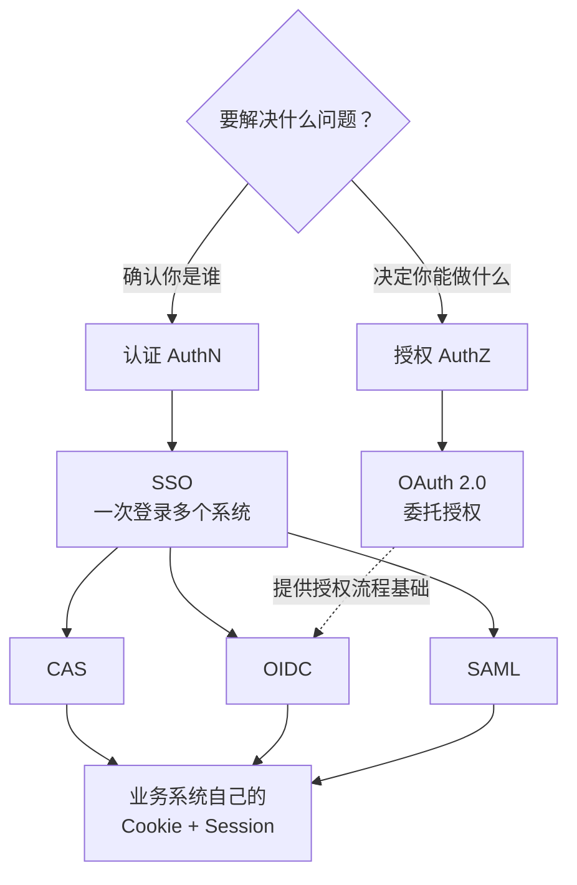
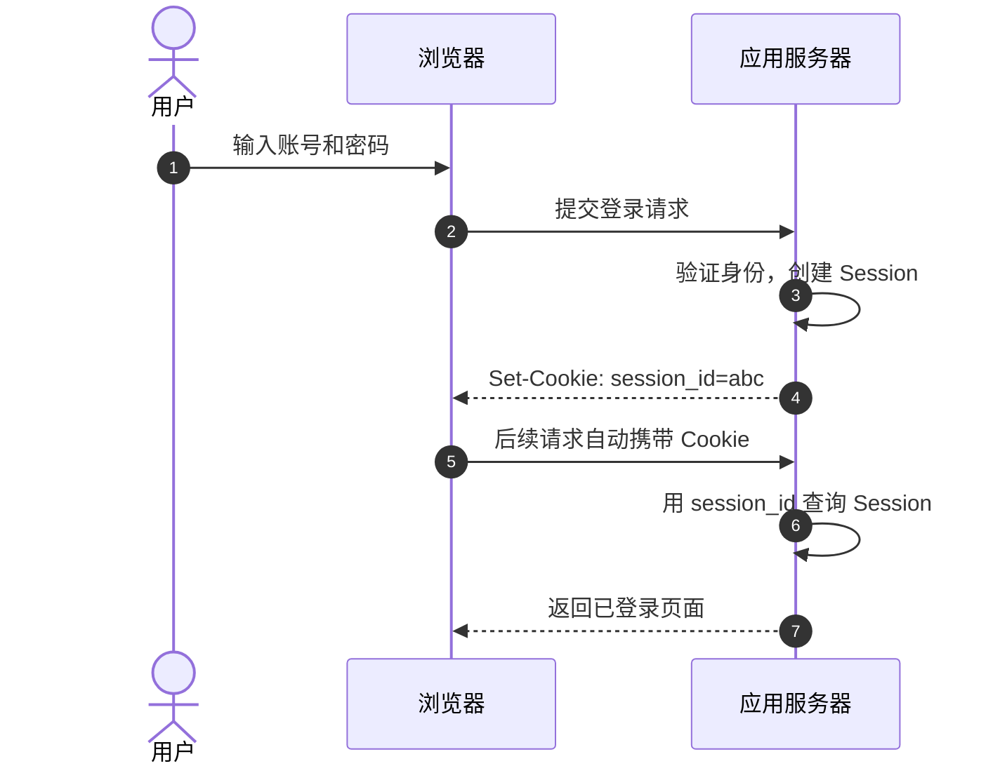
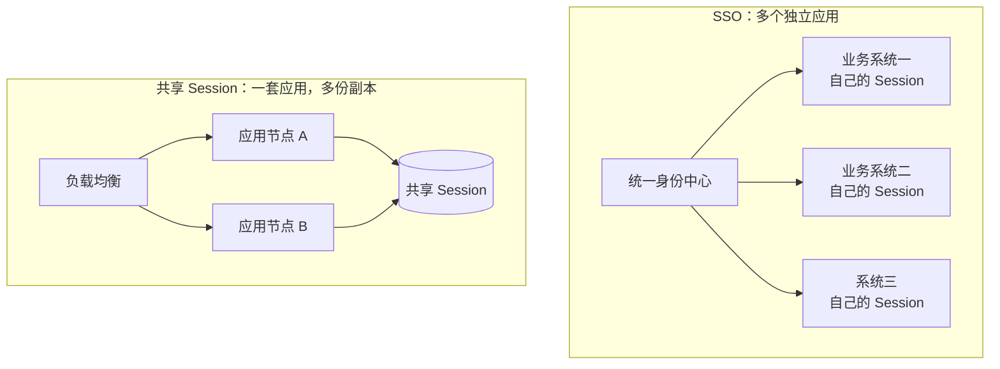
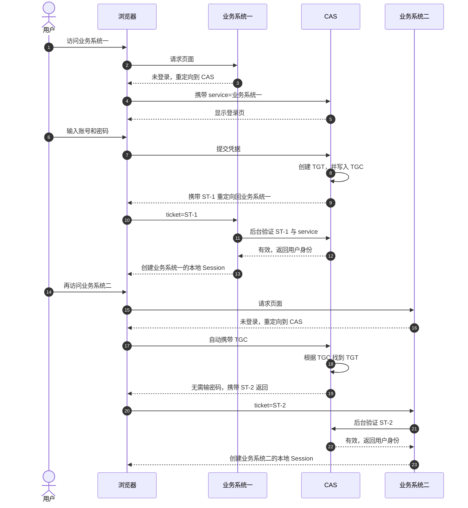
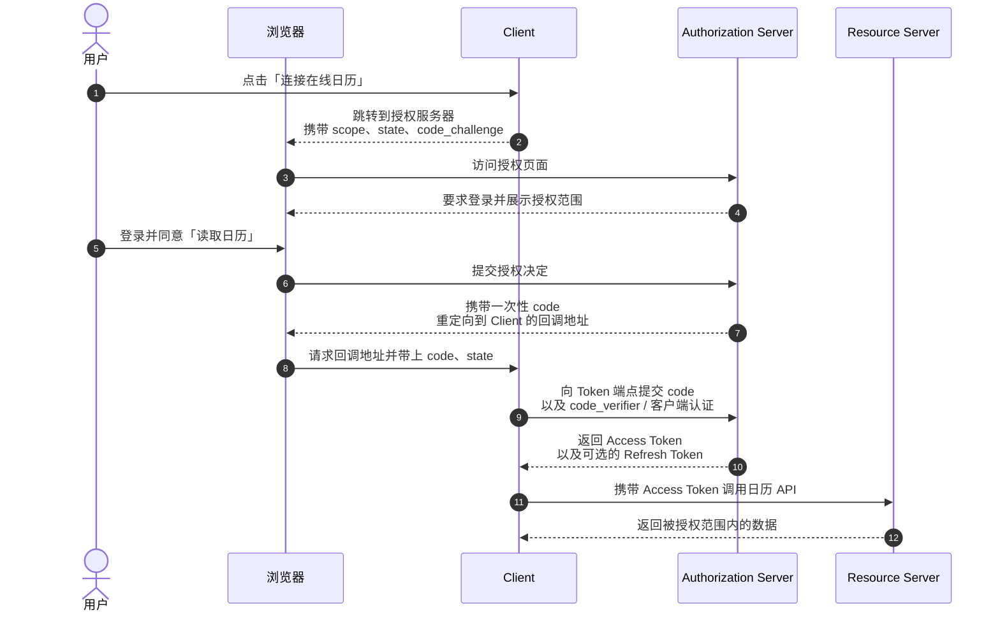
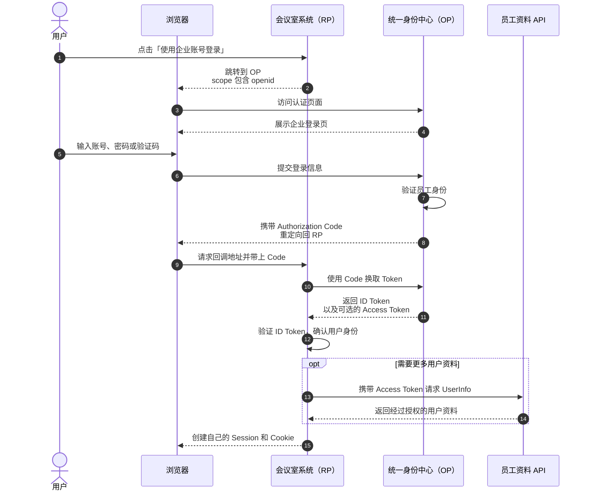
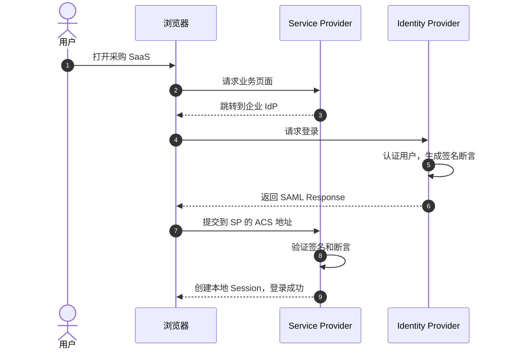
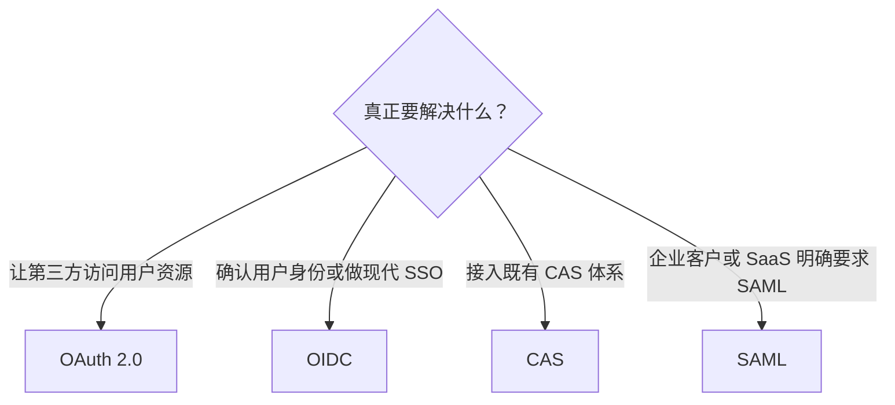

# 一次登录，到底发生了什么：从 Session 到 SSO、OAuth 2.0、OIDC 与 SAML

> 你只在统一身份中心输入了一次密码，随后打开 OA、邮箱和报销系统，却都已经登录；另一个日历工具甚至能在不知道密码的情况下读取你的日程。这些系统究竟拿到了什么，又凭什么相信它？

## 0x00 起因

在实习的时候碰到了一个需求，需要实现 H5 页面免密登录与重定向到具体的业务页面，H5 项目内部使用的是SSO单点登录的方式，最近也了解到了费曼学习法，正好借着这个契机梳理一下相关的技术内容。

Cookie、Session、Token、Ticket、Assertion，这些名词经常一起出现在登录代码中；CAS、OAuth 2.0、OIDC、SAML，也常被笼统地归进「第三方登录」。但它们并不都在解决同一个问题：有的负责确认身份，有的负责授予权限，有的是协议，还有的只是一种想要达到的效果。

上手做需求时容易觉得混乱，再加上单点登录通常涉及浏览器、业务系统和身份中心等多个组件，凭证在不同系统之间来回流转，调试起来就更难建立整体认识。

但其实你只需要记住，核心就只有三个问题：

1. **要解决的是认证，还是授权？**
2. **谁签发凭证，凭证要交给谁？**
3. **业务系统凭什么相信这张凭证？**

在展开前，先把它们的关系梳理一下：

这张图可以归纳成六句话：

1. **认证（Authentication，AuthN）** 回答「你是谁」，**授权（Authorization，AuthZ）** 回答「你能做什么」。
2. **Cookie + Session** 让一个系统记住用户已经登录；共享 Session 解决的是同一应用的多个服务副本如何共享登录状态。
3. **SSO（单点登录）是一种目标，不是一套具体协议**：用户登录一次，就能进入多个相互信任的业务系统。
4. **CAS、OIDC 和 SAML 都可以实现 SSO** ，区别在于它们使用什么身份凭证，以及业务系统如何验证凭证。
5. **OAuth 2.0 的本职是委托授权，不是身份认证。** 它不能单独作为标准的 SSO 身份协议；OIDC 借用了 OAuth 2.0 的授权流程，再补充 ID Token 等身份认证规范，因此可以用来实现现代 SSO。
6. 无论使用 CAS、OIDC 还是 SAML，跨系统凭证通常只负责把身份「送到门口」；验证通过后，每个业务系统往往仍会创建自己的 Cookie 和 Session。

所以，碰到认证、授权问题，只需要问自己三个问题：它是在传递身份还是授予权限，传递的凭证是什么，接收方又怎样相信它。

## 0x01 什么是认证与授权？

这两个词的本质区别是：

- **认证（Authentication，AuthN）**：你是谁？
- **授权（Authorization，AuthZ）**：你能做什么？

可以把它们想成坐飞机：

> 身份证证明「你是你」，这是认证；
>
> 登机牌决定「你能坐哪一班、哪个座位」，这是授权。

::: details Q：为什么要分清？
A：因为后面的协议虽然都和「登录」有关，但是它们的目标不同。CAS、OIDC、SAML 主要传递身份；而 OAuth 2.0 主要授予访问资源的权限。
:::

### Cookie 和 Session 怎么记住登录状态

在普通的单体应用里，登录流程很简单：

> **Cookie 存编号，Session 存状态。**
>
> 浏览器报上编号，服务器根据编号查出「这个人已经登录」。

这里其实有个容易混淆的地方：Cookie 是浏览器的存储与自动携带机制，不等于登录；Session 是服务端保存的一段会话状态，也不一定只用于登录。二者组合，才构成了常见的登录会话。

## 0x02 共享 Session 是一个好方案吗？

当一个应用从一台服务器扩展到多台服务器时，思考一下会出什么问题🤔？

> 用户在 A 节点登录，Session 存在 A 的内存；下一个请求被负载均衡到 B，B 不认识这个 Session，于是刚登录又掉线。

最直接的解决办法，是把 Session 从单机内存搬到 Redis 等共享存储。所有节点查同一份登录状态，这就是分布式 Session 常见的做法。

但如果再增加一个完全独立的业务系统呢🤔？

`共享 Session` 解决的是：**同一应用的多个副本，怎样认出同一个用户。**

而 `SSO` 解决的是：**多个独立应用，怎样共同相信同一次身份认证。**

⚠️ 不相关的站点不能随意共享 Cookie，每个系统的会话模型、权限模型也可能不同。

因此，SSO 的核心概念是抽出一个身份中心：用户只在中心完成一次认证，中心再向各业务系统出具可信凭证。

## 0x03 CAS：用一次性服务票据完成单点登录

SSO（Single Sign-On，单点登录）是一种目标：在多个相互信任的应用系统中，只需登录一次，就能访问所有系统。CAS（Central Authentication Service）是实现这个目标的一套协议。

CAS 的核心是一个独立的认证中心：只有它能接受用户名密码，其他系统不提供登录入口，只接受它的间接授权。企业、高校内部平台里都可以看见他的身影一般叫做统一登录门户。它会签发三个容易记混的凭证：

| 名称 | 放在哪里 | 作用 |
| --- | --- | --- |
| **TGT**（Ticket Granting Ticket） | CAS 服务端，本质是一个 Session | 记录用户已在 CAS 完成认证 |
| **TGC**（Ticket Granting Cookie） | 浏览器的 CAS 域下 | TGT 的 key，每次请求自动携带，CAS 凭它查 TGT |
| **ST**（Service Ticket） | 短暂经过浏览器，由业务系统验证 | 某个业务系统的一次性票据 |

举个通俗易懂的例子：把它想成住酒店：CAS 的认证中心是酒店前台，TGT 是前台的入住记录，TGC 是你手里的房卡编号，ST 是前台临时开给泳池或健身房的一次性入场券。

想要入住酒店并使用酒店的基础设施（泳池、健身房）时：

1. 酒店不认识你的身份，你先用身份证登记 = 账号密码登录 CAS 认证中心
2. 前台验证身份后，写下入住记录（TGT），把房卡编号（TGC）写进你的房卡 = 认证通过后，CAS 在服务端建 TGT，把 TGC 写进浏览器 Cookie
3. 你想去游泳，前台凭房卡确认你已入住，开一张泳池入场券（ST）= 访问业务系统一，被重定向到 CAS，CAS 凭 TGC 查到 TGT，为业务系统一签发 ST
4. 你拿入场券进泳池，泳池核验后放行 = 业务系统一后台向 CAS 验证 ST，通过后建立自己的登录态
5. 之后想去健身房，前台凭房卡编号查到入住记录，知道你登记过了，不用重新登记，直接开一张健身房入场券（新 ST）= 再访问业务系统二，浏览器自动带 TGC，CAS 查到 TGT 还在，免密签发新 ST

所以其实 TGC 和 TGT 是一对 key-value；ST 则是一次性的——有 TGC 只说明你登录过 SSO，不代表某个业务系统也登录，所以每个业务系统都要单独签发一张 ST。

第一次访问业务系统一，和随后访问业务系统二，CAS 单点登录流程：

CAS 能跨系统工作，是因为浏览器访问 CAS 时会带上 **CAS 自己的 TGC**。CAS 确认用户已经登录后，再为业务系统二签发一张新的 ST。

三个安全点也很好理解：

- ST **一次性且短时有效**，降低被重复使用的风险；
- ST **绑定具体 service**，发给业务系统一的票不能拿去业务系统二；
- 业务系统通过后端向 CAS **验证票据**，不能只相信浏览器说「我登录过」。

::: details Q：ST 是一次性的吗？每次请求都要拿 TGC 去 CAS 换一张新 ST 吗？
A：ST 确实一次性，但「一次性」指的是「验证一次就作废」，不是「每次请求都去换」。它只在登录建立的那一下用一次：业务系统拿 ST 后台向 CAS 验证、拿到用户身份后，就建好自己的本地 Session，之后的请求全靠这个本地 Session，不再经过 CAS。只有去访问另一个业务系统时，才需要为它单独签一张新 ST。
:::

## 0x04 OAuth 2.0：把权限借出去

前面讲的 Session、SSO 和 CAS，关注的都是「怎样确认你是谁」。但有些场景并不需要把你的身份交给另一个系统，而是要让另一个系统获得一部分操作权限。

比如，你正在使用一个日历整理工具，希望它帮你汇总在线日历中的日程。最直接的办法，是把日历账号和密码交给它，但这相当于把整串钥匙都给了陌生人：它不仅能读日历，还可能读邮件、改资料，甚至修改密码。

但其实真正想给出的只是一份可以随时收回的有限权限：

> 「允许这个日历工具读取我的日程，但不能修改日程，也不能访问其他数据。」

OAuth 2.0 就是为这个问题设计的。它是一套**委托授权框架**：资源的主人不需要交出账号密码，而是授权第三方应用在限定时间、限定范围内访问资源。

这里的「委托」表示让另一个应用替自己办事，「授权」则表示规定它具体能做什么。OAuth 2.0 本身主要回答的是「这个应用能访问什么」，并不负责标准化地证明「当前用户是谁」。

### 四个角色

OAuth 2.0 中有四个核心角色。继续使用日历工具的例子，它们分别是：

| 角色 | 含义 | 例子中的身份 |
| --- | --- | --- |
| **Resource Owner**（资源所有者） | 有权决定资源能否被访问的人 | 日历的主人，也就是用户 |
| **Client**（客户端） | 想获得授权、替用户访问资源的应用 | 日历整理工具 |
| **Authorization Server**（授权服务器） | 验证用户、征求同意并签发 Token | 在线日历的授权中心 |
| **Resource Server**（资源服务器） | 保存受保护资源、接收 Token 并提供 API | 保存日程数据的日历 API |

举个代客泊车的例子🌰：你是车主，泊车员是 Client；服务台确认你的意愿后，发给泊车员一把只能启动和停车、打不开后备箱的代客钥匙；车库则根据这把钥匙决定是否放行。

OAuth 2.0 中的 **Token（令牌）** 就像这把代客钥匙。它不是用户的密码，而是授权服务器签发给 Client 的访问凭证。

### 流程中的几张「票」

在进入流程前，认识一下几个名词：

| 名称 | 作用 |
| --- | --- |
| `scope`（权限范围） | 描述 Client 申请哪些权限，例如「读取日历」 |
| Authorization Code（授权码） | 授权成功后签发的一次性短期凭证，用来换取 Token |
| Access Token（访问令牌） | Client 调用资源 API 时出示的凭证 |
| Refresh Token（刷新令牌） | Access Token 过期后用来申请新令牌，可选且需要更谨慎地保存 |

其中最重要的区别是：**Authorization Code 用来换 Token，Access Token 才用来访问资源。**

现代应用最常用的是 Authorization Code Flow（授权码流程）。现代安全实践通常还会配合 PKCE；对于无法安全保存客户端密钥的浏览器应用、移动 App 等公共客户端，PKCE 尤其重要。

这里还是用上面日历的例子来解释一下：

1. 日历工具先把用户带到授权服务器，并说明自己想申请「读取日历」权限。
2. 用户只在授权服务器登录，日历工具始终接触不到账号密码。
3. 用户同意后，授权服务器先发一个短期、一次性的 Authorization Code，让浏览器带回日历工具。
4. 日历工具再通过直接请求，用 Code 换取 Access Token。机密客户端会同时证明自己的身份，公共客户端则使用 PKCE 证明自己持有本次请求对应的随机秘密。
5. 日历工具拿 Access Token 调用日历 API；资源服务器检查 Token 的有效期、权限范围等信息，只返回被允许访问的数据。

整个过程中，用户借出去的是一项可以限制、过期和撤销的权限，而不是自己的账号控制权。

::: details Q：为什么要多绕一道 Code，不直接把 Access Token 放进重定向地址？
A：因为重定向需要经过浏览器，URL 可能出现在历史记录、服务器日志或其他泄露渠道中。授权码流程让浏览器只传递短期、一次性的 Code，再由 Client 向 Token 端点直接换取 Access Token。换取时还要进行客户端认证或 PKCE 校验，因此仅截获 Code 通常不足以取得 Token。不过 Code 仍然是敏感数据，只是它的有效期更短，而且使用一次后就会失效。
:::

::: details Q：`state` 是什么，为什么回调时必须检查？
A：`state` 是 Client 在发起授权前生成的随机值，授权服务器会在回调时原样返回。Client 只有确认前后的 `state` 一致，才接受这次响应。它把「发出的授权请求」和「收到的授权结果」关联起来，可以防止攻击者把自己发起的授权结果塞进受害者的会话，这类攻击通常称为授权请求 CSRF 或登录 CSRF。
:::

::: details Q：PKCE 是什么，公共客户端为什么需要它？
A：运行在浏览器或用户手机中的应用无法可靠地隐藏固定密钥，因此被称为公共客户端。PKCE 会让 Client 为每次授权临时生成一个随机的 `code_verifier`，先把它转换得到的 `code_challenge` 发给授权服务器，换 Token 时再提交原始的 `code_verifier`。授权服务器比对成功后才接受 Code。这样，即使攻击者截获了 Code，没有对应的 `code_verifier` 也难以兑换 Token。
:::

## 0x05 OIDC：在 OAuth 2.0 上补一张身份证

讲到这里，可能会产生一个很自然的想法：既然日历工具拿到了 Access Token，它能不能顺便用这个 Token 判断用户是谁，从而实现「使用日历账号登录」？

问题在于，OAuth 2.0 只规定了如何获得访问权限，并没有统一规定 Access Token 必须包含用户身份、使用什么格式，或者 Client 应该怎样验证这份身份。Access Token 是发给资源服务器使用的「门禁卡」，不是发给 Client 的「身份证」。

为了在 OAuth 2.0 的流程上安全、统一地传递用户身份，OpenID Connect（简称 OIDC）增加了一层身份认证规范：

> **OIDC = OAuth 2.0 授权流程 + 身份认证规范 + ID Token**

因此，两者回答的是不同的问题：

- OAuth 2.0 回答「这个 Client 被允许访问什么」；
- OIDC 回答「登录到 Client 的这个用户是谁」。

### OIDC 中的新角色和新凭证

OIDC 沿用了 OAuth 2.0 的授权码流程，但对参与者有一组更贴近登录场景的称呼：

| 名称 | 含义 |
| --- | --- |
| End-User（最终用户） | 正在登录的人 |
| RP（Relying Party，依赖方） | 需要确认用户身份的业务系统，也就是 OAuth 2.0 中的 Client |
| OP（OpenID Provider，身份提供方） | 负责认证用户并签发身份信息的服务，建立在授权服务器能力之上 |

### 举个例子：使用企业账号登录会议室系统

假设公司里有一个「会议室预订系统」，但它不想再维护一套员工账号和密码，而是提供「使用企业统一账号登录」。在这个场景中：

- 你是 End-User，也就是准备登录的员工；
- 会议室预订系统是 RP，它需要知道登录者是哪位员工；
- 企业统一身份中心是 OP，只有它负责检查账号、密码或验证码；
- 员工资料接口是 UserInfo API，保存姓名、头像、部门等资料。

可以把 OP 想成公司前台，把 RP 想成会议室。前台亲自检查你的工牌后，不会把你的工牌原件交给会议室，而是出具一张写明「这个人已经核验、凭证签发给会议室系统、有效期到几点」的身份证明。会议室验证证明是真的、确实是签给自己的，而且没有过期，才让你进入。

这张给会议室系统看的身份证明，就是 **ID Token**。如果会议室系统还想读取你的头像和部门，则要拿另一张代表访问权限的 **Access Token**，去员工资料接口查询。一个负责证明身份，一个负责访问资源，不能混用。

当 RP 发起请求时，它会在 `scope` 中加入 `openid`。这个特殊的权限值是在告诉 OP：「这不只是一次普通授权，我还需要确认用户身份。」

认证成功后，RP 使用 Authorization Code 换取 Token，响应中除了可能包含 Access Token 和 Refresh Token，还会多出 OIDC 最关键的凭证——**ID Token**。

把流程拆开看，一共发生了六件事：

1. 你在会议室系统点击「使用企业账号登录」，会议室系统把浏览器带到统一身份中心。
2. 你只在统一身份中心输入登录信息，会议室系统看不到你的企业账号密码。
3. 身份中心验证成功后，先让浏览器带着一次性的 Authorization Code 返回会议室系统。
4. 会议室系统通过后端用 Code 换取 ID Token，并按照规则验证签名、签发方、接收方和有效期。
5. 验证通过后，会议室系统知道「这位员工是谁」，于是创建自己的 Session 和 Cookie。接下来的页面请求使用本地会话，不必反复走 OIDC。
6. 如果还需要姓名、头像或部门，会议室系统再携带 Access Token 调用员工资料接口；这一步是在读取资源，不是在验证 ID Token。

以后你再打开报销系统时，它也会把浏览器带到同一个统一身份中心。身份中心发现你在那里已经登录过，便可以直接为报销系统完成后续认证，不再要求输入密码。这就是「一次登录，访问多个业务系统」的由来。

这里有两种 Token，它们很像，但是用途却完全不同：

| 凭证 | 交给谁使用 | 表达的含义 |
| --- | --- | --- |
| **Access Token** | Resource Server，例如 UserInfo API | Client 被允许访问哪些资源 |
| **ID Token** | Client，也就是 OIDC 中的 RP | OP 对本次用户认证结果作出的声明 |

UserInfo 是 OIDC 定义的用户信息接口。如果 RP 需要昵称、头像等资料，可以携带 Access Token 调用它；ID Token 的主要职责则是把认证结果交给 RP。不要拿 ID Token 调用普通资源 API，也不要把面向资源服务器的 Access Token 直接当作登录凭证。

### ID Token 里写了什么

ID Token 使用 JWT（JSON Web Token）格式。JWT 是一种紧凑的令牌表示方式，由头部、载荷和签名三部分组成；其中一项项描述身份信息的数据叫作 **Claim（声明）**。

常见声明包括：

- `sub`（Subject）：用户在该 OP 中稳定且唯一的标识；
- `iss`（Issuer）：ID Token 是由谁签发的；
- `aud`（Audience）：ID Token 是签发给哪个 RP 的；
- `exp` / `iat`：令牌的过期时间和签发时间；
- `nonce`：RP 发起认证时提供的随机值，用来关联请求与响应并降低重放风险；如果请求中发送了它，RP 就必须验证返回值。

JWT 的头部和载荷通常只是经过编码，并没有加密，任何拿到令牌的人都可能解码查看。RP 不能因为字段能读出来就相信它，而要按照 OIDC 规则验证签名、`iss`、`aud`、有效期，以及请求中使用的 `nonce` 等信息。

> **能拆开信封看到内容，不等于能证明信封是真的；签名和声明校验才建立了信任。**

RP 确认身份后，通常仍会像普通 Web 应用一样创建自己的 Session，并通过 Cookie 维持登录状态。ID Token 负责把身份从 OP 安全地送到 RP，之后的页面请求不需要每次都重新执行一遍 OIDC 流程。

如果多个业务系统都信任同一个 OP，用户又已经在 OP 建立了登录会话，那么访问下一个业务系统时，OP 就可能直接完成认证而不再要求输入密码。这正是 OIDC 实现单点登录的基础。

所以，「使用某账号登录」如果真正目的是确认用户身份，应该使用 OIDC，或者明确了解服务提供方在 OAuth 2.0 之外定义的身份协议，不能把 OAuth 2.0 的 Access Token 天然当成身份证。

## 0x06 SAML：企业 SSO 的 XML 路线

SAML（Security Assertion Markup Language，安全断言标记语言）也是一套用来传递身份、实现单点登录的标准。它诞生得较早，使用 XML 格式传递身份信息，因此在今天的普通 Web 或移动应用新项目中不算常见，但在企业统一身份平台和一些成熟 SaaS 的对接中仍然能遇到。

理解 SAML，只需要先认识三个名词：

- **IdP（Identity Provider，身份提供方）**：负责验证用户身份；
- **SP（Service Provider，服务提供方）**：用户真正想访问的业务系统；
- **Assertion（断言）**：IdP 签发的身份说明，告诉 SP「这个用户已经通过认证」。

例如，员工想用企业账号登录某个采购 SaaS：采购 SaaS 是 SP，企业统一身份中心是 IdP。SP 不接收员工的企业密码，而是把浏览器带到 IdP；IdP 完成认证后，生成一份带签名的 SAML Response，其中包含身份断言，再由浏览器转交给 SP。

这里的 **ACS（Assertion Consumer Service）** 是 SP 专门接收 SAML Response 的回调地址。SP 收到响应后，会使用 IdP 的公钥验证签名，并检查断言是不是发给自己、是否过期等；验证通过后，再像前面的协议一样创建自己的本地 Session。

如果只记一个区别，可以这样理解：OIDC 通常用 JSON 和 JWT 传递身份，更适合现代 Web、移动端和 API 生态；SAML 主要通过浏览器传递签名的 XML 文档，更常见于已有的企业身份体系。新项目通常优先考虑 OIDC。

## 0x07 四套协议的应用场景

| 维度 | CAS | OAuth 2.0 | OIDC | SAML |
| --- | --- | --- | --- | --- |
| 本质 | SSO 协议 | 委托授权框架 | 基于 OAuth 2.0 的身份层 | 联合身份与 SSO 标准 |
| 回答的问题 | 怎样一次登录多个系统 | 第三方能访问什么资源 | 当前用户是谁 | SP 如何信任 IdP 的身份断言 |
| 核心凭证 | TGC / TGT / ST | Authorization Code / Access Token / Refresh Token | ID Token + OAuth 2.0 Token | SAML Assertion |
| 数据格式 | CAS 自有票据 | Access Token 格式不固定 | ID Token 是 JWT | XML |
| 典型信任方式 | 后台验证 ST | 资源服务器验证 Access Token | RP 验证 ID Token | SP 验证签名断言 |
| 常见场景 | 传统企业内部 Web | 第三方受限访问 API | 现代 Web、移动端身份与 SSO | 企业身份系统、SaaS 对接 |

如果想快速选型，可以先看业务目标是什么：

## 0x08 文章总结

回头看，这些概念其实可以压缩成一条主线：

1. 一个应用用 Cookie + Session 记住用户。
2. 同一应用扩成多个副本，用共享 Session 保持状态一致。
3. 多个独立应用要共享一次认证结果，就引入 SSO 和统一身份中心。
4. CAS 用服务票据做 SSO；SAML 用签名 XML 断言；OIDC 用 ID Token 标准化身份。
5. 第三方需要有限地访问用户资源时，用 OAuth 2.0 做委托授权。

真正贯穿全文的，其实是一个信任问题：

> **谁证明了什么，证明交给谁，接收方又凭什么相信。**

一句话总结：

> **Session 让一个系统记住你；SSO 让多个系统相信同一次认证；OAuth 2.0 把有限权限借给第三方；OIDC 用 ID Token 说明你是谁；CAS 与 SAML 则用各自的票据和断言完成企业单点登录。**

## 0x09 启示

遇到问题不要怕复杂，而是要从问题开始学。如果再遇到登录、鉴权或第三方接入的需求，不妨参考一下以下的流程来梳理：

1. **写清目标。** 是身份认证、权限判断、单点登录，还是委托访问资源？
2. **画出参与者。** 浏览器、客户端、业务服务、身份中心和资源服务分别是谁？
3. **标出凭证流向。** 哪些数据经过浏览器，哪些只走后端，凭证是否一次性、是否绑定接收方？
4. **列出验证清单。** 不只看签名，还要检查签发者、受众、时效、重定向地址、`state`、`nonce`、PKCE 等协议要求。

实操建议🔨：多抓包，观察一次真实登录，再搭一个小 Demo，对照规范逐项检查 Token 验证与退出流程。看一百篇技术文章不如实际上手操作一遍。

## 0x0A 写在最后
梳理了这么多，其实也只是实习企业里 SSO 的冰山一角，光了解概念和流程是远远不够的，真实生产场景的流程可能远远比这复杂得多。在如今 AI 盛行的时代，代码已经变得廉价。我认为技术实现已经不是那么重要了，因为 AI 都能做，写出来的代码不比资深开发差多少。而真正能拉开差距的是懂业务、懂流程、了解技术决策背后带来Trade Off、能够真正推动需求、项目落地的能力。

最后留一个问题给读者吧：

::: tip 问题
基于 SSO 单点登录，用户登录后在多个业务系统分别建立了本地会话。当用户从其中一个业务系统发起退出请求时，由于各个业务系统会话相互独立，这个时候你会怎么权衡用户的登录行为呢？你的 SSO 系统又该如何应对呢？
:::
