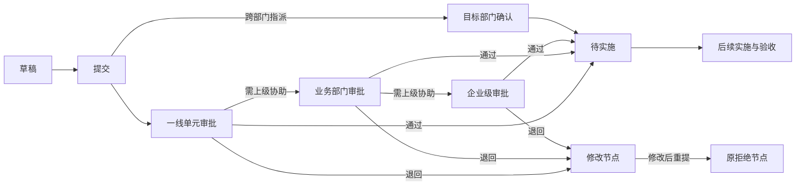
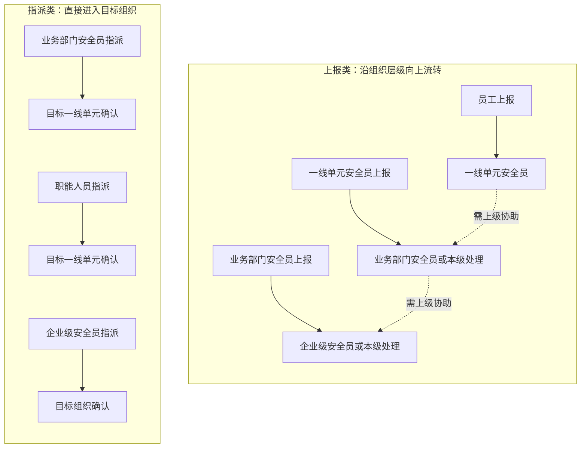
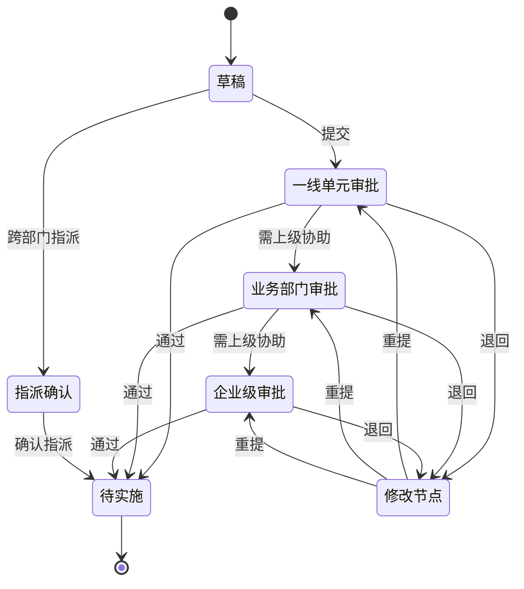
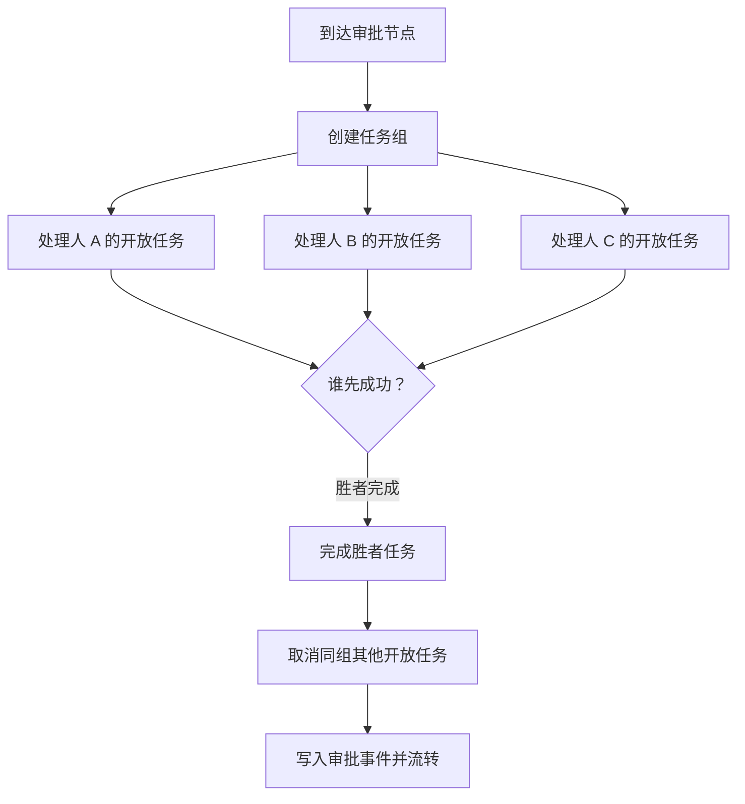
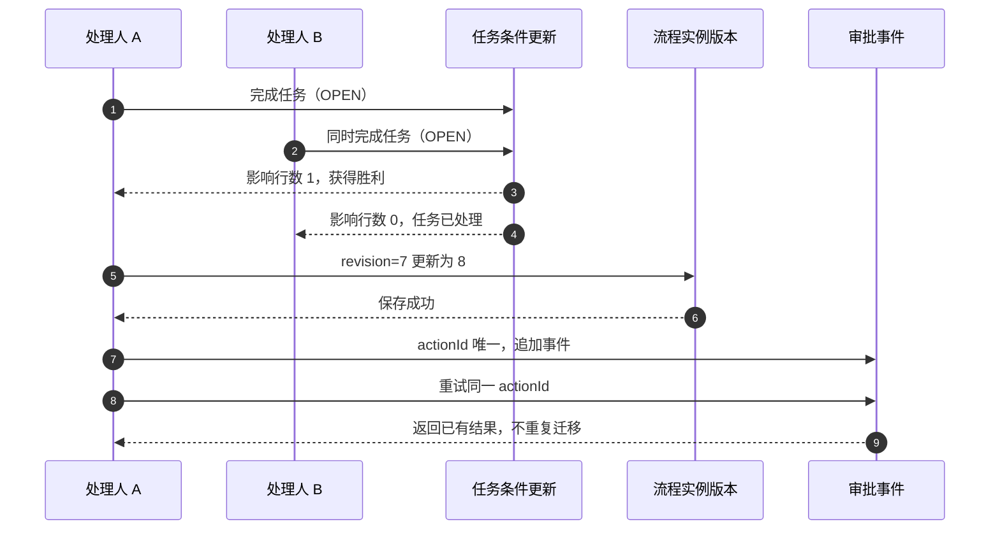
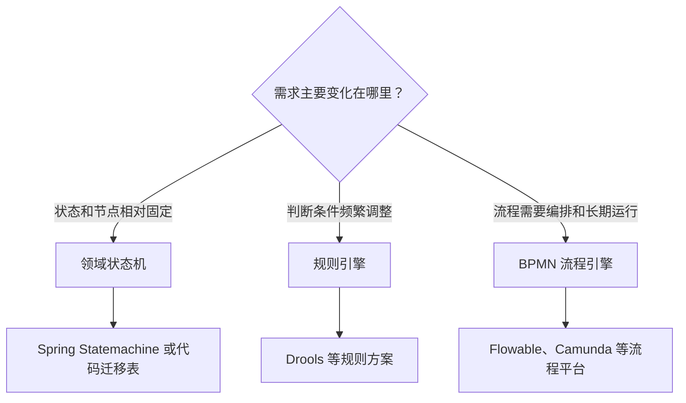

# 从流程图到状态机：我怎样落地一个审批需求
> 一名员工提交安全隐患后，任务会交给哪位安全员？审批人请求上级协助时该怎样继续，退回修改后又该回到哪里？如果两个人同时点下「通过」，系统还能不能只推进一次？


> 脱敏的 👉 [Forge Flow 审批流 在线运行示例](http://1.14.186.80:8081) 👈。
>
> 项目的访问码是：`FF-db706d2cd53a`

## 0x00 起因

实习期间，接触到一个制造业安全隐患治理项目。新需求是需要做审批流。

::: details 举个例子🌰

生活中类似的流程很多，比如报销、请假和物业报修。申请人先提交信息，负责审核的人确认内容和处理方式；材料不完整时退回补充，超出当前处理范围时继续交给上一级或其他部门。

这个项目更接近一张安全隐患治理工单。比如员工发现设备护栏松动，先填写问题、上传现场照片、视频；本级安全员判断由谁处理，缺少资源时请求上级协助，涉及其他部门时再进行指派。审批通过后，任务交给治理负责人继续实施，整个过程都要留下记录。
:::

那么问题来了🤔：谁来审、能不能让上级协助、退回以后回到哪里、如何跨部门指派，都需要与业务方确认。

需求看起来像「加几张表、写几个接口」，但真正展开以后可以发现是一个小型的领域建模问题。需求里同时出现了下面几件事：

- 按发起人身份区分的 **6 类业务流程**；
- 草稿、审批、退回、实施、验收等 **7 个状态阶段**；
- 一线单元、业务部门、企业级三个层级，最多 **三级角色路由**；
- 任意审批节点可退回，修改后要直达原拒绝节点；
- 一个节点可以有多人处理，任意一人完成即可，也就是或签；
- 上级可以把任务指派给其他部门，目标部门确认后再进入后续阶段。

翻译成图表是这样的



> 这张图里有一个容易被忽略的区别：**通过**和**需上级协助**不是同一个动作。通过表示当前审批人认可并进入待实施；需上级协助才表示把问题提升到更高一级。

先叠个甲~

> 本文是对实习期间设计过程的公开复盘。为了保护业务信息，文中保留制造业安全隐患治理、6 类流程和三级路由这些对理解方案有帮助的结构，隐藏企业名称、内部系统缩写、真实组织称谓、代码路径和表名。文末附有一份<a href="/lightweight-approval-workflow/approval-workflow-decision-log.html" target="_blank" rel="noopener">完整脱敏版设计决策记录</a>，可以继续查看逐条Trade Off。

> 实习设计聚焦的是审批流骨架和审批节点操作；攻关实施、验收、亮点审核、推广和导出属于后续阶段。后文提到的公开 Demo 是从这些约束中进一步抽象出的演示实现，也不是生产代码。


## 0x01 先来理解业务场景

先来理解业务流程

### 6 类流程

按发起人和目标组织区分，业务上有 6 类流程：

| 流程类型 | 发起场景 | 初始目标 | 后续特点 |
| --- | --- | --- | --- |
| 员工上报 | 基层员工提出隐患 | 本级一线单元安全员 | 可请求上级协助 |
| 一线单元安全员上报 | 一线单元安全员直接发起 | 业务部门安全员或本级处理 | 可继续向上协助 |
| 业务部门安全员上报 | 业务部门安全员发起 | 企业级安全员或本级处理 | 最高级不再上移 |
| 业务部门安全员指派 | 业务部门向其他部门发起 | 目标一线单元确认 | 目标单位是处理方 |
| 职能人员指派 | 职能部门协调治理 | 目标一线单元确认 | 发起人不占审批链 |
| 企业级安全员指派 | 企业级统筹任务 | 目标组织确认 | 适合跨部门任务 |

把六类流程放到一张图里，可以看到两条主线：上报类沿着发起人的组织层级向上流转，指派类直接进入目标组织确认。




发起人填写课题、分类和问题背景，再选择逐级上报或跨部门指派，流程类型会成为后续路由的输入。

这里的「员工」和「安全员」是公开文章里的泛化角色名，不对应任何真实组织。6 类流程的差异主要体现在**起点和路由策略**，不是要复制 6 份状态机。把流程类型作为路由输入，状态机仍然可以复用。

### 流程建模：状态、事件、守卫和动作

> 这里参考阅读了美团技术团队的推文：https://tech.meituan.com/2017/06/09/maze-framework-new.html

借用 FSM 的基本词汇，一个迁移可以写成：

```text
当前状态 + 事件 + 守卫条件 → 新状态 + 副作用
```

例如：

```text
审批中（一线单元） + 通过 + 任务仍开放
    → 待实施 + 完成当前任务、写入审批事件、生成后续待办
```

其中：

- **State** 是可持久化的业务状态，例如审批中、审核退回、待实施；
- **Event** 是外部发生的事实，例如提交、通过、退回；
- **Guard** 是迁移前必须满足的条件，例如当前人拥有任务、任务仍开放、退回节点合法；
- **Action** 是迁移成功后的副作用，例如创建任务、取消或签兄弟任务、发旁路通知。

把这些概念弄清楚之后，后面的表结构和测试用例都有了清晰的落点：状态负责回答「现在」，事件负责记录「发生过什么」，守卫负责阻止「非法迁移」，动作负责完成迁移后的「数据变化」。

## 0x02 分层状态机

### 为什么没有直接做扁平状态枚举

可以想到的一个最简单的模型实现方式是————「一个字段承载所有信息」：

```text
status = 一线单元审批中
status = 业务部门审批中
status = 企业级审批中
status = 一线单元退回
status = 业务部门退回
……
```

它的优点是前端拿到一个值就能展示，但缺点也很明显：

- 同一个「审批中」被拆成多个值，查询所有审批中的项目需要维护一串枚举；
- 「退回到哪里」和「当前处于哪个大阶段」混成一个概念；
- 新增一个组织层级时，状态值、文案、路由分支一起增加；
- 审批节点和处理任务仍然要另外建模，单个状态字段并不能解决人和权限问题。

因此，在真正落地的时候设计采用了复合状态：

```text
status       = 大阶段，例如审批中、审核退回、待实施
currentLevel = 审批层级，例如 1=一线单元、2=业务部门、3=企业级
flowType     = 六类流程之一，决定起点和路由
```

### 状态流转

有了状态表示，接下来再来梳理一下核心动作，写成迁移表，大致是这样：

| 当前节点 | 动作 | 守卫 | 目标节点 | 主要副作用 |
| --- | --- | --- | --- | --- |
| 草稿 | 提交 | 发起人本人、草稿状态 | 本级审批或目标部门确认 | 创建任务、写提交事件 |
| 任一审批节点 | 通过 | 当前任务开放 | 待实施 | 完成任务、写通过事件 |
| 一线单元/业务部门审批 | 需上级协助 | 当前不是最高级 | 上一级审批 | 完成任务、创建上级任务 |
| 任一审批节点 | 退回 | 目标节点可退回、原因非空 | 指定修改节点 | 记录恢复节点、创建修改任务 |
| 修改节点 | 修改后重提 | 存在恢复节点 | 原拒绝节点 | 消费恢复节点、重新创建审批任务 |
| 指派确认 | 确认 | 目标部门任务开放 | 待实施 | 完成确认、写确认事件 |

依旧画图表示：



## 0x03 角色路由：下一步到底交给谁

状态机解决了「去哪个节点」，但没有解决「这个节点的具体处理人是谁」。

这里把路由拆成两步：
1. 先确定节点类型
2. 再解析节点下的处理人。

### 先确定节点，再解析处理人

例如一条员工上报流程：

```text
发起人所属组织
    → 本级一线单元安全员
    → （需要上级协助时）业务部门安全员
    → （再次需要上级协助时）企业级安全员
```

跨部门指派则不同：

```text
发起人选择目标组织
    → 目标一线单元安全员确认
    → 确认后进入待实施
```

指派流程里的发起人不是审批链的一环，目标组织才是确认方。这一点如果只用一个 `current_handler` 字段表示，很容易把「发起人」「当前处理人」「攻关负责人」混为一谈，所以要把它们分开：

- 发起人：创建并提交项目的人；
- 当前处理人：当前节点可以办理任务的人；
- 攻关负责人：审批结束后负责实施的人；
- 目标组织：跨部门指派要承担任务的组织。

### 或签：一组任务，任一人获胜

当一个节点对应多个安全员时，不把多人拼成一个字符串再由业务代码解析，而是创建一个任务组：同一组里每个人有一条待办，第一位完成的人成为胜者，其余任务在同一事务中标记为失效。




待办页按当前身份展示可办理任务，并在任务卡上提供确认指派、审批通过、请求上级协助和退回等操作。

这样做的好处是：
1. 流程实例只关心节点有没有完成
2. 任务组负责表达「多人中任一人可办」。

如果未来要从或签改为会签，也只需要把「取消兄弟任务」换成「等待所有任务完成」，历史事件和流程节点不必重写。

### 处理人数据的缓存边界

安全员信息来自外部人员和组织数据源。审批流如果每次迁移都实时调用外部服务，外部超时就会变成审批阻塞。最终采用的是一个本地角色映射层：

1. 先查本地的组织—角色—人员映射；
2. 命中时直接生成任务，不把外部服务放在主路径上；
3. 未命中时按需查询外部数据并播种本地映射；
4. 通过周期同步刷新变动；
5. 没有任何处理人时显式报错，不静默创建一个没人负责的任务。

这个取舍的核心不是「缓存一定比实时查询快」，而是把不可控的外部可用性从主事务中拿出来。代价是角色变更有同步延迟，冷启动时仍需要一次初始化同步；收益是已有映射命中时，审批流可以在外部服务短暂不可用时继续工作。

## 0x04 例外路径：退回不是回滚

审批流最复杂的也最考验建模质量的地方，我觉得是退回。

### 定点退回和普通状态回退不是一回事

- 如果只保存 `status=审核退回`，系统知道项目退回了，却不知道应该回到哪个节点。
- 如果直接把主表状态改回「审批中」，又会丢失「谁退回的、为什么退回、修改后应该从哪里开始」这些信息。

在项目中的退回设计是把退回看成了一次新的业务事件：

1. 审批人选择目标修改节点，并填写退回原因；
2. 当前任务完成，其他同组任务失效；
3. 流程实例记录原审批节点作为恢复节点；
4. 项目进入审核退回，生成目标修改节点的任务；
5. 修改人提交后，消费恢复节点，直达原拒绝节点；
6. 旧审批记录全部保留，新的重提和再次审批继续追加。

这里的「直达」意味着跳过中间节点。例如企业级审批把项目退回到一线单元，一线单元修改后重提，下一步直接创建企业级审批任务，而不是重新从一线单元到业务部门再走一遍。

### 可退回节点从历史事实推导

用户可以选择的退回节点，不是一个需要额外维护的静态配置表，而是根据当前实例已经走过的审批事件推导出来：

```text
已完成的审批节点 + 当前流程允许的修改入口 + 发起人
    → 去重后的可退回节点列表
```

这样做有两个好处：一是列表只展示这条实例真正经过的节点，二是历史和可操作选项使用同一份事实来源。

### 退回、重提和撤回的边界

退回和撤回看起来相似，语义却不同：

- 退回是审批人的决定，带有目标节点和原因；
- 重提是被退回方修改后的新动作，必须消费一次恢复节点；
- 撤回通常是发起人主动取消尚未处理的申请。

这也是为什么没有用「把当前状态改回草稿」来实现退回。状态修改只能表达现在，事件和恢复节点才能表达从哪里退回以及要重提到哪里去。

## 0x05 当前状态与历史事实分离

审批系统经常有两个互相拉扯的需求：

页面要快速展示当前状态，审计又要回答完整历史。思考一下🤔

- 如果所有信息都放在一张主表里，历史会被覆盖；
- 如果所有信息都从历史实时计算，列表查询又会变重。

最后把审批流数据分成四类：

| 数据对象 | 负责回答的问题 | 是否允许覆盖 |
| --- | --- | --- |
| 业务项目 | 项目标题、发起人、当前业务状态 | 当前字段可以更新 |
| 流程实例 | 当前节点、流程定义版本、恢复节点、版本号 | 只维护当前快照 |
| 人工任务 | 谁可以办理、任务组、开放/完成/失效 | 状态按条件更新 |
| 审批事件 | 谁在什么节点执行了什么动作 | 只追加，不修改 |


项目台账读取当前快照展示运行状态、当前节点和处理人，完整审批历史留在项目详情中查询。

### 为什么放弃主表 JSON

旧思路是把审批过程塞进主表 JSON 字段。它确实省了一张表，但代价是：

- 查询「我审批过的所有项目」很难利用索引；
- 退回后查最近一次拒绝节点，需要在 JSON 数组里定位元素；
- 两个请求同时修改整段 JSON 时，容易发生覆盖；
- 统计通过率、退回率和处理耗时都要先解析 JSON；
- 一次意外的序列化差异就可能让整条历史不可读。

独立的追加式审批事件表的好处是：

把「一次动作」作为最小记录单位。记录里至少包含实例、节点、动作、操作者、来源节点、目标节点、意见、请求唯一键和实例内序号。


### 用事件序号串起完整审批记录

每次提交、通过、退回和重提都会追加一条审批事件，并在当前流程实例内分配递增序号。详情页按事件序号排列这些记录，就能还原完整的审批过程：谁在什么节点执行了什么动作，项目流转到了哪里。


详情页把当前审批节点和事件时间线并排展示，可以沿着事件序号查看一次完整流转。

时间戳用于展示动作发生的具体时间和跨实例查询，实例内的流转顺序由事件序号确定。

想知道「第一次通过是谁、退回后第二次通过是谁」，按序读取事件即可。

## 0x06 并发与幂等：把一次操作关进一个事务

审批流里至少有两类并发：同一任务被多人同时办理，以及同一个请求因为网络重试被重复提交。二者都不能只靠前端按钮置灰解决。

### 第一层：任务条件 CAS

或签场景下，两个处理人可能同时点击通过。任务完成采用条件更新，核心条件是「任务仍开放且属于当前处理人」：

```sql
UPDATE 任务表
SET    status = 'COMPLETED', completed_at = :now
WHERE  task_id = :taskId
  AND  assignee_id = :actorId
  AND  status = 'OPEN';
```

返回影响行数为 `1` 才能继续流转；返回 `0` 表示任务已经被处理、取消或不属于当前人，事务直接失败并提示刷新。这样数据库是最终裁判，两个并发请求中只有一个能拿到任务。

### 第二层：流程实例版本 CAS

任务 CAS 保护了人工任务，但流程实例本身也要有乐观锁版本。每次迁移都携带读取到的实例版本，保存时要求版本仍然匹配：

```text
读取 revision = 7
    → 更新实例并追加事件
    → 只有 revision = 7 的更新可以成功
    → 成功后 revision = 8
```

如果另一个请求先把版本推进到 `8`，后来的更新会触发冲突。任务状态和实例版本是两道闸门，分别覆盖「谁拿到了这条待办」和「流程是否仍处于这个节点」。

### 第三层：actionId 唯一约束

网络超时后，客户端往往不知道第一次请求究竟有没有成功，于是会重试。每次动作携带一个客户端生成的 `actionId`，审批事件对它建立唯一约束：

- 第一次看到这个 `actionId`：执行迁移并追加事件；
- 再次收到同一个 `actionId`：返回第一次处理结果，不再写新事件；
- 收到不同 `actionId` 但任务已被别人处理：返回流程冲突。

这三种情况要区分开。**幂等**只保证同一个动作重放不会产生第二个副作用；它不意味着任何重复点击都应该返回成功。

### 事务边界

一次审批操作涉及的写入通常包括：

```text
1. 条件完成当前任务
2. 取消同组其他开放任务
3. 更新流程实例节点与 revision
4. 更新业务项目当前状态
5. 追加审批事件
6. 创建下一节点任务
```

这些写入必须在同一个数据库事务中完成。任何一步失败，前面的状态和事件都回滚，避免出现「页面显示已通过，但下一节点没有待办」这种半成功状态。

通知推送不应该阻塞这条主路径。可以先提交状态和事件，再由旁路任务发送通知；通知失败记录日志并告警，待后续补偿。若要做到「事件提交后一定送达」，下一步应引入 Outbox 。



> 图中的两道 CAS 和一个唯一键分别解决不同问题：任务 CAS 解决竞争，实例版本解决流程快照竞争，`actionId` 解决请求重放。缺少任何一层，都可能在边界条件下留下重复记录或错误流转。

## 0x07 外部依赖与故障边界

审批流不是孤立的，它会依赖人员、组织、消息和权限数据。真正的工程问题不是「有没有调用外部服务」，而是要明确哪些调用属于主路径，哪些失败可以延迟处理。

### 角色缓存的三种情况

| 场景 | 主流程行为 | 运维动作 |
| --- | --- | --- |
| 本地映射命中 | 直接创建任务 | 周期同步继续刷新 |
| 本地未命中、外部查询成功 | 播种映射后继续 | 记录播种日志 |
| 本地未命中、外部查询失败 | 显式报错，不创建悬空任务 | 下一周期重试或人工同步 |

### 消息是旁路，不是状态机的一部分

Web 待办和流程状态属于主路径；企业消息、邮件或其他推送属于旁路。推送失败时，不能把已经完成的审批再回滚，否则消息服务的短暂故障会扩大成业务数据故障。

旁路至少要留下三类信息：目标处理人、关联事件和失败原因。等后续引入 Outbox 或重试队列后，可以根据事件补发推送消息。

### 权限和可见性要单独定义

「能不能处理」和「能不能查看」是两个不同问题。任务权限由当前任务的处理人决定，项目列表可见性则要根据业务规则决定。一个安全员可以有权查看项目详情，却没有权处理别人的待办；也可能相反，跨部门协同需要查看项目但不允许修改。

## 0x08 加餐：成熟的审批流方案怎么选

写 TRD 时，我第一次系统地查了审批流的成熟方案。搜索结果里既有 Spring Statemachine，也有 Flowable、Camunda 这类 BPMN 流程平台。它们已经把状态迁移、人工任务、网关、定时器和历史查询等能力整理成框架。

对当时的我来说，这种「把流程定义交给引擎执行」的方式很有吸引力。我也想借这个需求接入一个开源框架，顺便把流程引擎的建模和运行机制学一遍。继续阅读文档以后，我把常见方案整理成了三类，再逐一对照项目需求。

### 状态机：管理有限状态的迁移

[Spring Statemachine](https://docs.spring.io/spring-statemachine/docs/current/reference/) 提供状态、事件、迁移、守卫和动作等状态机能力，也支持层级状态等更复杂的结构。它适合节点数量有限、迁移关系清楚、流程规则由开发人员维护的场景。

状态机负责组织流程骨架。人工任务分配、组织权限、审批记录和消息投递仍然要结合业务系统实现。本文前面的复合状态、迁移表和守卫条件就属于这一层。

### 规则引擎：集中处理频繁变化的判断

[Drools](https://kie.apache.org/docs/components/drools/) 这类规则引擎会接收一组事实，再根据规则条件决定执行哪些动作。例如：

```text
事实：风险等级高、涉及跨部门、发起人属于某类角色
规则：高风险项目需要企业级安全员确认
结果：选择企业级审批路由
```

当流程路由依赖大量业务条件，而且这些条件需要频繁调整时，规则引擎可以把判断逻辑集中管理。它通常作为决策组件，为状态机或流程引擎返回路由结果。

### BPMN 流程引擎：编排人与系统的长期协作

[Flowable](https://www.flowable.com/open-source/docs/) 和 [Camunda](https://docs.camunda.io/docs/components/concepts/processes/) 都提供以 BPMN 为基础的流程建模与执行能力。流程定义中可以包含人工任务、服务任务、网关、定时器、并行分支和异常路径，引擎负责创建流程实例并保存运行状态。

这类方案适合流程需要在线编排、跨天等待、并行汇聚、超时处理和版本管理的场景。团队同时需要维护流程引擎的运行时、数据库、部署配置和排障方式，并处理引擎任务与现有组织、权限、表单和业务数据之间的连接。

### 放到一张选择图里



回到这次实习项目，我最后选择了领域状态机，判断依据很具体：

1. 业务只有 6 类固定流程，路由层级最多 3 级；
2. 流程定义由开发和评审维护，没有在线拖拽编排的需求；
3. 主要工作集中在退回直达、或签、角色解析和并发控制；
4. 旧系统已经有自己的项目、组织、权限和待办模型，引入新的运行时会增加接入与维护成本。

这次调研也没有白费。它让我知道成熟框架已经解决了哪些问题，也让我开始按项目规模判断工具的投入时机。以后出现大量可配置节点、长时间等待、并行汇聚和定时器时，流程引擎会成为更合适的选择。

## 0x09 公开 Demo：对抗抽象的最好方式是实现它

脱敏的 GitHub 仓库地址： 👉 [Forge Flow 审批流 Demo](https://github.com/Quashy/forge-flow-demo) 👈。

在线体验：[Forge Flow 审批流 Demo](http://1.14.186.80:8081)

项目的访问码是：`FF-db706d2cd53a`

> 是对本文设计的进一步抽象，包括流程定义，提供单页工作台、人工任务、或签、退回直达、权限检查和追加式审计；

> ⚠️非实习项目的生产源码。

## 0x0A 局限与演进

方案的边界也必须包括在设计里。

### 当前明确的局限

- 流程定义固定在代码中，没有 BPMN 编辑器和在线编排；
- 路由最多覆盖三级角色，新增组织层级需要增加路由枚举和处理人解析；
- 外部角色映射存在周期同步延迟，冷启动需要初始化同步；
- 消息推送是旁路，没有可靠 Outbox 时仍可能出现「状态已提交、通知稍后补发」；
- 当前需求只覆盖审批骨架和节点操作，实施、验收、亮点审核、推广和批量导出没有在本期完成；

### 如果后续要投入研发优化

如果后续需求扩大，可以按下面的顺序演进：

1. 先把角色解析封装成稳定接口，隔离人员数据源变化；
2. 为通知增加 Outbox 和补偿重试，保证事件与消息最终一致；
3. 为流程定义增加版本和迁移策略，保护运行中实例；
4. 把路由条件提取为可测试的策略配置，观察规则数量是否真的值得引入规则引擎；
5. 只有出现大量可配置节点、长时间等待和并行汇聚时，再评估 BPMN 流程引擎。

> 每一步都应该由真实痛点驱动，而不是因为「流程引擎」这个技术听起来更高大上。

**一切技术都是为了解决痛点、实现业务而服务**

## 0xFF 写在最后

回头总结一下这个审批流：

- 用复合状态描述当前阶段和审批层级；
- 用流程类型决定起点，用角色路由决定处理人；
- 用任务组表达或签，用恢复节点表达退回直达；
- 用追加式事件保留历史，用当前快照支撑列表查询；
- 用任务 CAS、实例版本和 `actionId` 唯一约束处理并发与重试；
- 用明确的外部依赖边界，避免人员服务或消息服务故障拖垮主流程。

对一个**流程数量有限、业务规则相对固定**的项目来说，把有限状态、任务权限和数据一致性做好，把需求完成好，留足扩展空间，我觉得往往比提前引入一套庞大的编排平台更容易交付和维护。

看了这么久到最后也挺不容易，我们不妨来思考一个问题吧🤔：

::: tip 问题
在目前的系统架构和流程设计下，一条审批流程已经运行了一段时间，后来业务要求增加第四级审批，或者调整某一类流程的路由。你会怎样给流程定义做**版本化**？

正在运行的实例继续按创建时的规则走完，还是切换到新规则？如果选择切换，当前任务、历史记录和后续节点又该怎样保持一致？
:::

### 参考阅读

- [Spring Statemachine 官方文档](https://docs.spring.io/spring-statemachine/docs/current/reference/)
- [OMG BPMN 2.0 规范](https://www.omg.org/spec/BPMN/2.0/About-BPMN/)
- [Camunda 流程与人工任务文档](https://docs.camunda.io/docs/components/concepts/processes/)
- [Flowable Open Source 文档](https://www.flowable.com/open-source/docs/)
- [Drools 官方文档](https://kie.apache.org/docs/components/drools/)
- <a href="/lightweight-approval-workflow/approval-workflow-decision-log.html" target="_blank" rel="noopener">完整脱敏版审批流设计决策记录</a>
- [Forge Flow 脱敏 Demo](https://github.com/Quashy/forge-flow-demo)

<details>
<summary>附录：13 项设计决策与 30 个技术方案 QA</summary>

下面的附录保留了设计记录中的决策编号和 QA 编号。

### 13 项设计决策

#### 决策 1：状态字段设计

- **背景**：审批中有三个层级，退回后还要直达指定节点。
- **备选**：用一个扁平 `status` 表达所有组合；用 `status + currentLevel` 表达阶段和层级；在此基础上把退回目标放入主表或从历史推导。
- **选择**：使用 `status + currentLevel + flowType`，退回目标只记录在审批事件中。
- **理由**：审批中查询可以只按 `status` 过滤；流程类型只负责路由；退回目标只有一个事实来源，避免主表和历史双写不一致。

#### 决策 2：审批记录存储方式

- **背景**：把过程存进主表 JSON 会导致查询困难、整段覆盖和退回定位复杂。
- **备选**：延续 JSON；新建独立审批记录；记录采用更新式或追加式。
- **选择**：独立记录，采用 INSERT-only 追加式写入。
- **理由**：可以按项目、处理人和动作建索引；并发时各自追加，不覆盖整段历史；时间线和统计更自然。

#### 决策 3：处理人来源

- **背景**：节点处理人来自外部人员和组织数据源。
- **备选**：每次实时查询；本地映射按需播种并周期同步；外部查询加短缓存。
- **选择**：本地映射命中优先，未命中时按需播种，后台周期同步。
- **理由**：把外部可用性从主路径移开；同步延迟是可控成本，外部故障导致审批瘫痪是不可控风险。

#### 决策 4：或签实现方式

- **背景**：同一节点有多个处理人，任意一人办理即可。
- **备选**：只维护当前处理人字符串；在业务代码中散落清理逻辑；建立任务组。
- **选择**：用任务组为每名处理人创建独立任务，首个成功者完成节点并取消兄弟任务。
- **理由**：任务权限和处理状态可追踪；并发竞争有明确落点；未来改会签时只需更换任务组完成规则。

#### 决策 5：分期范围

- **背景**：需求同时包含审批、实施、验收、亮点和台账能力。
- **备选**：一次性实现所有阶段；先做审批骨架和节点操作；只做数据字段不做完整交互。
- **选择**：本期聚焦流程状态、路由、任务、通过、退回、上级协助和指派确认；实施、验收、亮点、推广和导出留作后续。
- **理由**：先交付一个闭环，避免审批节点的操作体验断裂；后续阶段可以独立迭代。

#### 决策 6：项目编号格式

- **背景**：项目需要可读且可排序的业务编号。
- **备选**：沿用旧编号；改成泛化前缀加日期与随机短后缀。
- **选择**：采用统一前缀、日期和唯一短后缀，并在数据库增加唯一约束。
- **理由**：可读性和碰撞兜底兼顾，编号生成失败时有限重试。

#### 决策 7：发起人身份判定

- **背景**：身份决定流程类型和初始路由，但外部身份数据的稳定性需要确认。
- **备选**：登录时实时请求外部数据；先使用可替换的演示/配置身份；完全写死角色。
- **选择**：使用可替换的身份解析接口，阶段性以配置或演示身份验证流程，后续接入稳定数据源。
- **理由**：不让不稳定的外部服务进入登录和提交流程，同时为正式身份源保留接口边界。

#### 决策 8：风险选择数据源

- **背景**：部分风险分类和区域权限数据源尚未完全确认。
- **备选**：临时复制一份外部数据；先做固定选项；暂缓并记录依赖。
- **选择**：暂缓接入，先把审批流依赖的最小字段做稳定。
- **理由**：避免把未经确认的数据源固化进 API 和表结构，待业务口径明确后再接入。

#### 决策 9：「需上级协助」动作

- **背景**：不同层级的协助动作最终都表示向上一级流转。
- **备选**：每一级使用不同动作；统一为一个动作并由节点上下文解释。
- **选择**：统一为 `upperHelp` 语义的一个动作。
- **理由**：行为一致，节点和层级已经保留上下文，不需要为了文案差异复制动作枚举。

#### 决策 10：可退回节点列表

- **背景**：退回目标必须来自当前实例真实经过的路径。
- **备选**：另建流程配置表；写死一份节点列表；从审批事件推导。
- **选择**：从已完成的审批事件去重推导，并始终允许回到发起人修改节点。
- **理由**：不增加第二份路由事实，历史记录和操作选项一致。

#### 决策 11：消息推送时机

- **背景**：Web 待办可以先满足核心闭环，外部消息渠道还需要单独对接。
- **备选**：把消息调用放进审批事务；本期只维护 Web 待办；同步等待消息成功。
- **选择**：主事务只维护状态、任务和事件，消息作为旁路，后续引入可靠投递。
- **理由**：通知失败不阻塞流程，也不会把外部故障扩散到核心数据。

#### 决策 12：弹窗字段矩阵

- **背景**：不同角色和不同动作需要不同的补充字段。
- **备选**：所有动作展示同一组字段；前端写很多互相嵌套的判断；整理成动作—角色矩阵。
- **选择**：按角色、节点和动作组合决定弹窗字段，并在服务端再次校验。
- **理由**：操作界面只展示当前动作需要的内容，服务端规则仍是最终约束。

#### 决策 13：后续实施处理人

- **背景**：审批完成后还要进入实施阶段，实施负责人和审批人可能不是同一类角色。
- **备选**：重新查询一名默认处理人；使用审批阶段实际确认过的处理人；暂缓实施阶段。
- **选择**：后续阶段优先引用审批事件中真实产生的处理人信息。
- **理由**：不因人员配置变化而重新解释已完成的审批，也能保留责任链；实际实施阶段仍需独立的业务规则。

### 30 个技术方案 QA

#### Q1：项目状态是怎么流转的？

草稿提交后进入本级审批或目标部门确认；审批人可以通过、请求上级协助或退回。通过进入待实施，请求上级协助进入更高一级，退回进入修改节点；修改后重提直达原拒绝节点。实施、验收和已验收属于后续阶段。

#### Q2：怎么判断项目当前在哪个状态、哪个审批节点？

用 `status` 判断大阶段，用 `currentLevel` 判断审批中的层级，用当前任务判断具体处理人。退回状态下，`currentLevel` 不作为展示依据，页面展示修改任务和最近退回事件。

#### Q3：退回后重新提交，怎么实现直退？

退回事件保存目标修改节点和原审批节点；流程实例进入审核退回并创建修改任务；修改人重提时消费恢复节点，直接在原审批节点创建新任务，跳过中间层级，历史事件不删除。

#### Q4：怎么确定每个节点的处理人？

先根据 `flowType` 和当前节点确定角色层级，再查本地组织—角色映射。命中就直接创建任务，未命中才按需查询外部数据并播种；仍找不到时显式报错。

#### Q5：或签机制具体怎么工作？

同一节点创建一个任务组，为每位候选人创建开放任务。任意一人成功完成后，事务内取消同组其他开放任务，下一节点只创建一组新任务。

#### Q6：「需上级协助」和「通过」有什么区别？

通过表示当前节点认可并进入待实施；需上级协助表示当前人认可但希望更高层级继续判断，只能在非最高层使用。两者都是独立动作，历史记录保留原节点和目标节点。

#### Q7：审批通过后项目去了哪里？本期做到什么程度？

公开 Demo 中通过或指派确认后进入待实施。实习设计本期主要做到审批骨架和节点操作，后续实施、验收和亮点阶段另行设计，不把未完成阶段写成已上线能力。

#### Q8：退回时可以选哪些节点？

从当前实例已经完成的审批事件中筛选可作为目标的节点并去重，同时保留发起人修改入口。服务端还要按当前节点、流程类型和权限再次校验，不能只信前端下拉选项。

#### Q9：指派流程和上报流程有什么区别？

上报流程由发起人的组织关系决定审批链，可以逐级请求上级协助；指派流程必须选目标组织，提交后直接进入目标组织确认，发起人不占审批链。

#### Q10：发起人身份怎么判定？为什么可以先用演示身份？

身份解析应该是独立接口。外部数据源稳定前，可以用配置或演示身份验证状态机和权限路径；等本地角色映射与同步跑通后，再接入正式身份源，避免把外部故障放进登录主路径。

#### Q11：为什么不用 JSON 字段存审批记录？

JSON 不利于按处理人、动作和时间建立索引，并发更新容易整段覆盖，退回后定位最近目标也容易出错。独立记录让每次动作成为可查询、可追加的事实。

#### Q12：审批记录为什么只 INSERT 不 UPDATE？

追加式记录可以保留完整审计轨迹，多个审批人各自追加不会互相覆盖，按实例序号即可得到稳定时间线，退回后重提也不会丢失旧历史。

#### Q13：审批操作涉及多类写入，怎么保证一致性？

任务条件完成、同组任务失效、流程实例更新、业务快照更新、事件追加和下一任务创建放在同一个事务。任一步失败就整体回滚；消息通知放在旁路处理。

#### Q14：或签时两个人同时点「通过」怎么办？

两个人都可以先读到开放任务，但只有一个请求能让任务条件更新影响行数为 `1`。另一个请求得到 `0`，事务回滚并提示任务已被处理；流程实例版本 CAS 继续提供第二层保护。

#### Q15：用户连续点两下「通过」会重复写两条审批记录吗？

同一次业务动作使用同一个 `actionId`。第一次成功后，第二次重放命中唯一键并返回第一次结果；如果是新的 `actionId`，则会因为任务已完成而返回冲突，不会重复流转。

#### Q16：项目编号并发怎么办？

编号生成可以先做应用层候选检查，数据库再加唯一约束作为最终兜底。发生唯一键冲突时有限重试，超过次数则明确报错，不返回一个可能重复的编号。

#### Q17：如果查不到处理人怎么办？

显式返回「该组织未配置对应层级处理人」的错误，不创建没有负责人的任务。运维侧检查角色映射、同步任务和组织配置，修复后重新提交或重试。

#### Q18：通知推送失败，审批流还走不走？

走。状态、任务和事件是主路径，通知是旁路；通知失败要记录目标、事件和原因，并通过后续重试或 Outbox 补发。

#### Q19：删除项目时审批记录怎么办？

审批记录是审计数据，不应因为业务项目删除而级联清除。若有合规清理要求，应该走独立的数据保留和归档策略，不在普通删除接口里隐式完成。

#### Q20：角色数据源挂了，审批流还能用吗？

本地映射命中时可以继续；未命中且需要播种时会显式失败；周期同步本次失败则记录并等待下一周期。冷启动时本地全空且外部不可用，必须提前做初始化同步或人工配置。

#### Q21：怎么回滚？表结构变更怎么办？

优先设计向后兼容的新增字段和新增表，代码回滚不依赖删除数据。不可逆的删列、改类型和历史重写不应混入普通发布；数据库迁移需要单独评审和备份。

#### Q22：老数据迁移怎么处理？

老数据可以给新增流程类型填充明确默认值，或者在查询层把缺省值视为「未分类」。迁移脚本要可重复执行、可审计，并在上线前核对默认值不会改变旧项目的业务含义。

#### Q23：审批时间线按什么顺序展示？

按实例内递增事件序号展示，时间戳作为辅助信息。每条事件包含节点、动作、操作者和来源/目标节点，追加式表本身就是完整链路。

#### Q24：处理人能不能看到其他组织的项目？

处理权限和查看权限分开设计。当前 Demo 采用简化的演示可见性规则；生产系统需要根据发起组织、目标组织和协同范围增加过滤，不能把 Demo 行为直接当成业务授权结论。

#### Q25：定时同步任务第一次什么时候跑？

部署时先完成结构迁移和必要的数据初始化，应用启动后立即执行一次全量同步，再按周期任务刷新。这样可以减少冷启动第一个用户提交时才发现没有处理人的延迟。

#### Q26：以后增加第四级审批怎么改？

增加层级枚举、角色映射和路由策略，扩展事件中的节点层级；如果状态模型已经把层级独立出来，通常不需要重做历史表。运行中实例要继续使用原定义版本。

#### Q27：某一类流程的审批链变了怎么办？

给新实例使用新的流程定义版本，或在路由策略中按版本选择链路。历史实例继续按创建时版本执行，事件记录真实经过的节点，避免今天的配置覆盖昨天的事实。

#### Q28：处理人数据源更换怎么办？

只替换角色解析和同步适配器，本地组织—角色映射作为稳定边界；状态机、任务和事件层不应该感知外部系统的名称和接口格式。

#### Q29：状态阶段要增减怎么办？

若只是增加审批层级，优先扩展独立的 `currentLevel` 和路由；若是增加新的业务大阶段，再扩展状态并补齐迁移、权限、展示和历史兼容。不要把每个例外都塞进一个退回状态。

#### Q30：以后要改成会签，怎么改？

任务组从「一人完成即成功、取消兄弟任务」改为「每人完成自己的任务，全部完成后统一流转」。流程实例、事件表和 `actionId` 约束仍可复用，只需补充汇聚规则和超时处理。

</details>
