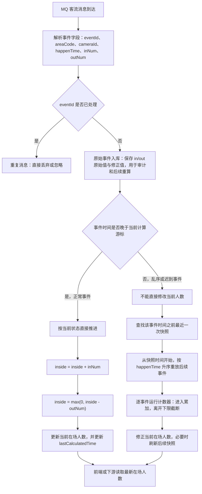

# 消息先到，不代表事情先发生：MQ 乱序下的事件时间与状态回放


> MQ 先送达的消息，不一定对应先发生的事情。只要状态转移依赖事件顺序，把到达时间当成发生时间，就可能得到一个稳定但错误的结果。

## 0x00 起因

实习时碰到了的基线项目的一个缺陷，感觉还是挺有意思的，分享一下：

客流相机每 5 分钟上报一次进入人数和离开人数。现场有多个相机，不同相机的 MQ 消息会因为上报配置、设备时钟、重试等原因乱序到达。业务方需要根据客流相机上报的 MQ 消息去计算进出场人数、在场人数

**关键错误：** 如果消费端按 MQ 到达顺序直接更新在场人数，就把「处理时间」误当成了「事件发生时间」

```text
初始 inside = 0

真实顺序：
10:00 进入 5 人
10:05 离开 5 人
结果 inside = 0

MQ 到达顺序：
先到 10:05 离开 5 人 -> inside = max(0, 0 - 5) = 0
后到 10:00 进入 5 人 -> inside = 5
错误结果 inside = 5
```

两条消息都成功消费了，计算过程也没有抛出异常，但最终在场人数从正确的 `0` 变成了 `5`。


## 0x01 为什么聚合不行？

原有代码逻辑解决了问题的表象，至少不会出现负数，却没有解决根本问题：

```java
inside += inNum;
inside = Math.max(0L, inside - outNum);
```

这个业务不能简单地理解为 `sum(in) - sum(out)`。在场人数不是普通加减法，而是一个带下限截断的状态机。

一旦有 `Math.max(0, ...)`，计算就不再满足交换律。事件顺序变了，结果也可能改变。

| 顺序 | 计算过程 | 结果 |
| --- | --- | ---: |
| 进入 5，再离开 5 | `0 + 5 = 5`；`max(0, 5 - 5) = 0` | 0 |
| 离开 5，再进入 5 | `max(0, 0 - 5) = 0`；`0 + 5 = 5` | 5 |

**问题本质：非交换状态的业务逻辑遇到了乱序事件。**

如果业务只关心某一天累计进入和离开多少人，分别求和就足够了；但只要要回答「此刻里面有多少人」，每一次下限截断都会成为后续状态的一部分，历史顺序就不能被忽略。

## 0x02 Flink 怎样理解时间与乱序

可以先想一个真实场景：**实时数据流就是源源不断的快递**，数据是快递包裹，时间是包裹上的发货时间。

实时处理最大的痛点是：**快递不一定按发货顺序送达**。网络延迟、节点抖动都会导致「早发出的包裹，晚到驿站」，这就是流式计算中的乱序数据，也正好对应这里的 MQ 问题。

Flink 处理实时数据时，是怎么解决的呢🤔？：

1. 到底以什么时间为准计算数据？
2. 乱序的事件要等到什么时候，才可以结算一个窗口？

### 三种时间语义

- **处理时间（Processing Time）**：驿站员工收到并处理快递的时间。它最直接，但会受到网络延迟、乱序和机器处理速度影响。
- **事件时间（Event Time）**：快递真实的发货时间，也就是数据所记录的业务发生时间。它让系统可以按照业务时间线重放计算。
- **摄入时间（Ingestion Time）**：快递进入驿站大门的时间，也就是事件进入 Flink 的时间。它介于前两者之间，但本文场景不采用这种时间语义。

### Watermark 水位线核心逻辑

既然用最精准的事件时间，数据又是乱序的，Flink 不知道「迟到的快递还会不会来」，无限等下去会卡死计算。

于是 Flink 设计了水位线机制：**水位线是一个时间戳，代表「所有早于这个时间的数据，已经全部到达，不会再来新数据」的全局凭证**。

简单说：水位线 = **实时数据流的时间进度条 + 窗口关闭的通行证**。

我们通常设置「最大乱序延迟」，比如 3 秒。意味着：当最新数据时间是 10 点 10 分 20 秒，水位线就走到 10 点 10 分 17 秒。Flink 判定：**17 秒之前的所有数据，就算迟到也不会再出现，直接关闭对应时间窗口，触发计算**。


## 0x03 把 Event Time 映射到客流相机

客流相机的消息应该采用 `Event Time`，因为 MQ 到达时间不等于真实发生时间。

### Processing Time 为什么会算错

假设 MQ 到达顺序是：

```text
10:05 离开 5 人先到
10:00 进入 5 人后到
```

如果用 `Processing Time`，服务端看到的顺序就是：

```text
先处理离开，再处理进入
```

这就会算错。这也是初版基线代码使用 `Math.max(0, ...)` 的原因，避免在场人数降为负数异常值，是属于治标不治本的 fix

### Event Time 关心事情何时发生

`Event Time` 看消息里的业务时间：

```json
{
  "eventId": "pdc-20260703-1000-camera-01",
  "areaCode": "area-a",
  "cameraId": "camera-01",
  "happenTime": "2026-07-03T10:00:00+08:00",
  "enter": 5,
  "exit": 0
}
```

即使这条消息 10:08 才被消费，只要它的 `happenTime` 是 10:00，我们就把它归到 10:00 的业务时间线上。

所以我们应该关心 **这件事什么时候发生的**，而非 **MQ消息到达即去消费**

### Watermark

由之前的 Flink 讲解，我们可以知道  `Watermark = T`  的意思是 **系统认为 T 时间及之前的数据，都已经到了**。

举个例子：

```
当前已经看到最大事件时间 = 10:10
允许乱序 = 5 分钟

watermark = 10:10 - 5min = 10:05
```

这表示：现在认为 10:05 及以前的数据大概率都到了，可以触发 10:00~10:05 窗口的计算。


### 站在巨人的肩膀上

项目组不会只为这一个缺陷引入 Flink。但是我们可以借鉴它处理实时数据上的思想：

```text
不要相信消息到达顺序；
用事件时间决定计算顺序；
给乱序设置可控等待边界；
在边界内进行聚合计算。
```

## 0x04 解决方案

整体思路是：**MQ 消息只负责承载事件事实，真正的在场人数必须按照业务发生时间计算。**



正常事件走**增量推进**，异常/迟到事件走**快照回放**：

```text
正常事件：
当前事件时间 >= lastCalculatedTime
-> 直接基于当前 inside 继续计算

乱序/迟到事件：
当前事件时间 < lastCalculatedTime
-> 先入库
-> 从最近快照开始按事件时间重放
-> 重新得到当前 inside
```

## 0x05 具体落地：幂等、游标与快照

每次 MQ 消息来了之后：

```text
1. 根据 eventId 幂等判断，重复消息直接跳过
2. 原始事件入库
3. 判断该时间桶是向前推进，还是需要修正历史状态
```

判断逻辑：

```java
if (eventTime >= lastCalculatedTime) {
    // 正常顺序事件
    applyOne(event);
} else {
    // 迟到事件，不能直接叠加到当前人数
    replayFromSnapshot(eventTime);
}
```

### 正常事件怎样计算

如果这条事件时间比当前计算游标更新，可以直接顺序推进：

```java
void applyOne(EventPdc event) {
    // 读取该区域当前已经计算出的在场人数。
    // state 来自 area_code 维度的状态表，
    // 表示系统已经按事件时间顺序计算到 lastCalculatedTime。
    long inside = state.getInsideNum();

    // 进入人数先累加到当前在场人数。
    // 如果同一条事件里同时存在 inNum 和 outNum，需要固定计算顺序，
    // 否则在场人数带下限截断时可能产生不同结果。
    inside += event.getInNum();

    // 离开人数再从当前在场人数中扣减。
    // Math.max(0, ...) 用来保证在场人数不会出现负数。
    inside = Math.max(0L, inside - event.getOutNum());

    // 将本次事件处理后的在场人数写回状态。
    state.setInsideNum(inside);

    // 更新计算游标，表示该区域已经按事件时间计算到当前事件。
    state.setLastCalculatedTime(event.getUtcEventTime());
}
```

比如：

```
当前 inside = 3

10:05 enter=2, exit=5

inside = 3 + 2 = 5
inside = max(0, 5 - 5) = 0
```

### 迟到事件怎样计算

迟到事件不能这样做：
```java
currentInside += lateEvent.getInNum();
currentInside -= lateEvent.getOutNum();
```

因为它属于历史时间点，可能影响从那一刻之后的整条人数轨迹。

正确做法是从最近快照开始重放：

```java
void replayFromSnapshot(LocalDateTime eventTime, String areaCode) {
    // 找到迟到事件发生时间之前最近的一次快照。
    // 快照记录的是某个历史时间点已经计算好的在场人数，
    // 从这里开始重放可以避免每次都从第一条历史事件重新计算。
    Snapshot snapshot = findLatestSnapshotBefore(areaCode, eventTime);

    // 以快照中的在场人数作为重放起点。
    long inside = snapshot.getInsideNum();

    // 查询快照之后该区域的所有客流事件。
    // 注意这里不能只查迟到事件本身，因为迟到事件可能改变后续整段人数轨迹。
    List<EventPdc> events = queryEventsAfterSnapshot(
        areaCode,
        snapshot.getSnapshotTime()
    );

    // 按业务事件时间排序，而不是按 MQ 到达时间或数据库入库时间排序。
    // eventId 用作同一事件时间下的稳定排序字段，保证多次重放结果一致。
    events.sort(
        Comparator.comparing(EventPdc::getUtcEventTime)
                  .thenComparing(EventPdc::getEventId)
    );

    for (EventPdc event : events) {
        // 进入人数会增加当前在场人数。
        inside += event.getInNum();

        // 离开人数会扣减当前在场人数，但在场人数不能小于 0。
        // 这个 max(0, ...) 使得计算依赖事件顺序，所以必须按事件时间重放。
        inside = Math.max(0L, inside - event.getOutNum());
    }

    // 用重放后的结果修正该区域当前在场人数。
    updateCurrentInside(areaCode, inside);
}
```

举个例子：

```text
初始 inside = 0

MQ 到达顺序：
10:05 离开 5 先到
10:00 进入 5 后到
```

如果按 MQ 顺序算：

```
离开 5 -> inside = 0
进入 5 -> inside = 5
错误
```

如果按事件时间重放：

```
10:00 进入 5 -> inside = 5
10:05 离开 5 -> inside = 0
正确
```

最终结果重新变为正确的 `0`。

## 0x06 幂等、并发与快照边界

主流程清楚以后，还有很容易踩坑的边界。

### 幂等唯一约束

两个消费者会同时查到 `eventId` 不存在，再分别写入同一条消息。数据库用 `eventId` 建唯一约束。

### 同一个 areaCode 必须串行

同一个 `areaCode` 的计算必须串行，否则两个消费者同时修改当前人数会互相覆盖；不同 `areaCode` 之间则可以并行。

这里需要做并发控制：

```
Redis 分布式锁 lock:pdc:area:{area_code}
```


其他可选做法包括：

- 优先把 `areaCode` 作为 MQ 分区键，形成单写者模型；
- 使用按分区键路由（亲缘线程池）的执行器，让同一区域落到同一条执行线程；
- 使用数据库行锁或乐观版本号保护状态行；


### 快照

原始 MQ 事件是事实来源，当前在场人数和快照只是可重建的投影，以及前端数字大屏的展示数据来源。

Pros:
>  - 快照可以避免每次从第一条历史事件开始计算

Crons:
>  - 迟到事件落在快照之前，受影响的快照就必须失效或重建。


## 0xFF 写在最后

背八股的时候，总是会背到 MQ 顺序消息问题

- 同一个 key 的数据发到同一个 partition；partition 内消息严格 offset 有序

- 同一个 partition 内，消费者拉取出来的消息，和生产者发送顺序一致

但实际业务的并发场景中，往往涉及多生产者多消费者 + 一些特定的业务逻辑，导致很多场景其实往往并不是八股背的那样hahahaha，还是要多去实践，碰到问题去解决问题

很多时候遇到的业务问题其实都有很标准的解决方案，比如文中提到的 `Flink Time` 与 `Watermark` 的概念，也能极大的拓宽思路，这也不妨是一个很好的学习充电方式😊

其实在控制并发的方案中的亲缘线程池方案也很有意思，有空可以琢磨一下出一个 blog 来学习一下~

### 参考阅读

- [Apache Flink：Event Time and Watermarks](https://nightlies.apache.org/flink/flink-docs-stable/docs/learn-flink/streaming_analytics/)
- [Apache Flink：Windows 与 Allowed Lateness](https://nightlies.apache.org/flink/flink-docs-stable/docs/dev/datastream-v2/builtin-funcs/windows/)
- [Apache Flink：Debugging Windows & Event Time](https://nightlies.apache.org/flink/flink-docs-stable/docs/ops/debugging/debugging_event_time/)
