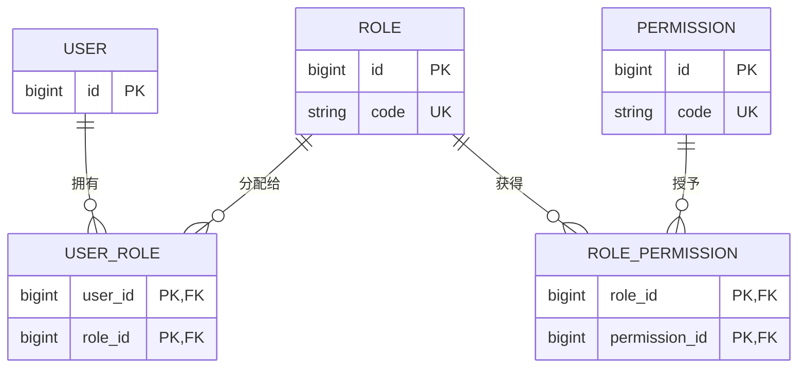
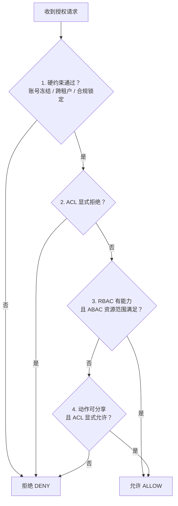

# 权限不是一串 if：从硬编码到 RBAC、ABAC 与 ACL


> 当权限规则只有「学生能写作业、老师能批改作业」时，一串 `if` 已经够用。真正难的设计是：只能操作哪一份资源、要满足什么条件，以及谁能获得一次例外。

## 0x00 起因

最近复盘到一道很典型的场景设计题：

题目大致是：

有三类人：

- 学生
- 老师
- 家长

他们都有一些基础属性：

- 名字
- 年龄
- 角色

系统中有一些权限：

- 学生、老师、家长都可以查看作业
- 学生可以写作业
- 老师可以批改作业
- 学生、老师可以出入校园
- 家长只能查看作业

如果继续补充真实业务，还可能会有：

- 老师只能查看自己班级学生的作业
- 家长只能查看自己孩子的作业
- 学生只能提交自己的作业
- 学生只能在截止时间前提交作业
- 某份作业可以单独分享给某个人查看

题目要求：

> 用 Java 类表述上述关系，并且尽量做到高内聚、低耦合，方便后续扩展。


## 0x01 第一种直觉写法：大而全的统一校验方法

最容易想到的方式是写一个统一的 `PermissionChecker`，传入 `person` 和 `action`，然后根据角色和动作判断。


### 1.1 基础类型

```java
/**
 * 用户角色：权限分配的根身份，同一角色共享同一组权限。
 */
enum Role {
    /** 学生：可查看、写作业并出入校园。 */
    STUDENT,
    /** 老师：可查看、批改作业并出入校园。 */
    TEACHER,
    /** 家长：仅可查看作业。 */
    PARENT
}
```

```java
/**
 * 权限动作：系统内可被执行的最小操作单元。
 *
 * <p>动作与角色解耦：一个动作可被多个角色共享（如查看作业），也可只属于单一角色（如批改作业）。</p>
 */
enum Action {
    /** 查看作业：学生、老师、家长共有。 */
    VIEW_HOMEWORK,
    /** 写作业：仅学生。 */
    WRITE_HOMEWORK,
    /** 批改作业：仅老师。 */
    GRADE_HOMEWORK,
    /** 进入校园：学生、老师。 */
    ENTER_CAMPUS,
    /** 离开校园：学生、老师。 */
    LEAVE_CAMPUS
}
```

```java
/**
 * 人员：权限主体。
 *
 * <p>字段使用 {@code final} 且不提供 setter，保证实例不可变，权限判断期间身份与角色不会被中途篡改。</p>
 */
class Person {
    private final String name;
    private final int age;
    private final Role role;

    public Person(String name, int age, Role role) {
        this.name = name;
        this.age = age;
        this.role = role;
    }

    public String getName() {
        return name;
    }

    public int getAge() {
        return age;
    }

    public Role getRole() {
        return role;
    }
}
```

### 1.2 大而全校验类

```java
/**
 * 大而全的权限校验器：在单个方法内按角色判断动作是否被允许。
 *
 * <p>这是最直观的写法，但把「角色 × 动作」的分配关系硬编码进分支；
 * 新增角色或动作都要修改本方法，违背开闭原则，仅适合规则极少。</p>
 */
class PermissionChecker {
    /**
     * 判断指定人员是否拥有执行某动作的权限。
     *
     * <p>默认拒绝：未命中任何角色分支时返回 {@code false}。</p>
     *
     * @param person 权限主体
     * @param action 待校验动作
     * @return 允许返回 {@code true}，否则返回 {@code false}
     */
    public boolean hasPermission(Person person, Action action) {
        // 学生：查看 / 写作业、出入校园
        if (person.getRole() == Role.STUDENT) {
            return action == Action.VIEW_HOMEWORK
                    || action == Action.WRITE_HOMEWORK
                    || action == Action.ENTER_CAMPUS
                    || action == Action.LEAVE_CAMPUS;
        }

        // 老师：查看 / 批改作业、出入校园
        if (person.getRole() == Role.TEACHER) {
            return action == Action.VIEW_HOMEWORK
                    || action == Action.GRADE_HOMEWORK
                    || action == Action.ENTER_CAMPUS
                    || action == Action.LEAVE_CAMPUS;
        }

        // 家长：仅查看作业
        if (person.getRole() == Role.PARENT) {
            return action == Action.VIEW_HOMEWORK;
        }

        // 未知角色一律拒绝，避免默认放行
        return false;
    }
}
```

使用方式：

```java
PermissionChecker checker = new PermissionChecker();

Person student = new Person("张三", 18, Role.STUDENT);

boolean allowed = checker.hasPermission(student, Action.WRITE_HOMEWORK);
```

### 1.3 这个方案的优点

- 简单直接，在初始设计时很容易想到。
- 权限判断至少集中在一个类里，没有散落到所有业务代码中。
- 对非常小的业务规则来说，可以快速表达角色和动作的关系。

### 1.4 这个方案的问题

核心问题是：

```text
所有角色和所有动作都耦合在一个大方法里。
```

如果新增角色：

```text
校长、保安、访客
```

就要继续往 `hasPermission()` 里加 `if`。

如果新增动作：

```text
查看成绩、发布公告、审批请假
```

也要继续修改这个方法。

它的问题包括：

- 违反开闭原则：新增角色或权限时必须修改原方法。
- 可读性差：所有权限规则混在一起。
- 可测试性差：一个方法要覆盖所有角色和动作组合。
- 不支持动态权限：无法通过配置或数据库调整权限。
- 容易变成「上帝方法」。

所有变化都被压进了同一个方法。每新增一个角色、动作或例外，都要重新打开这段代码。测试规模也会从几条示例，迅速变成「角色数 × 权限数 × 资源状态数」的组合。


大方法真正危险的地方是它把几类变化耦合在了一起：

- **角色与权限的分配关系**会变化；
- **用户与资源的关系**会变化；
- **截止时间、租户、账号状态**等环境条件会变化；
- **某个资源的临时授权**也会变化。

一个方法同时承担这些职责，最后通常会出现两种结果：要么任何小改动都可能影响其他权限，要么开发者害怕误伤，不断往末尾补新的 `if`。


### 1.5 如何评价这个方案

可以这样理解这个方案：

> 最直观的方式是写一个统一的 `PermissionChecker`，传入用户和动作，根据角色判断是否允许。这个方案简单，而且权限逻辑集中。但如果把所有判断写在一个大方法里，后续新增角色或权限都要修改这个方法，容易违反开闭原则，也不支持动态配置。


## 0x02 访问者模式：拆开了代码，却没有拆开变化

另一种写法是访问者模式。

访问者模式适合：

```text
对象结构稳定，但操作类型经常新增。
```

放到这道题中，就是：

```text
学生、老师、家长这三类人比较稳定。
权限动作可能不断新增。
```

### 2.1 Person 接口

```java
/**
 * 人员抽象：被访问者接口。
 *
 * <p>通过 {@link #accept(PermissionVisitor)} 将权限判断委托给访问者，
 * 实现「双分派」：具体调用哪个 {@code visit} 重载由运行时实际类型决定。</p>
 */
interface Person {
    String getName();

    int getAge();

    /**
     * 接受访问者，并把本次权限判断委托给它。
     *
     * @param visitor 权限访问者
     * @return 该访问者针对本对象给出的判定结果
     */
    boolean accept(PermissionVisitor visitor);
}
```

### 2.2 三类人员

```java
/**
 * 学生：被访问者实现。
 *
 * <p>权限规则不写在本类，而是交给访问者，保持人员类职责单一。</p>
 */
class Student implements Person {
    private final String name;
    private final int age;

    public Student(String name, int age) {
        this.name = name;
        this.age = age;
    }

    @Override
    public String getName() {
        return name;
    }

    @Override
    public int getAge() {
        return age;
    }

    @Override
    public boolean accept(PermissionVisitor visitor) {
        // 传入 this，编译期据此选择 visit(Student) 重载，这是双分派的核心
        return visitor.visit(this);
    }
}
```

```java
/**
 * 老师：被访问者实现。
 */
class Teacher implements Person {
    private final String name;
    private final int age;

    public Teacher(String name, int age) {
        this.name = name;
        this.age = age;
    }

    @Override
    public String getName() {
        return name;
    }

    @Override
    public int getAge() {
        return age;
    }

    @Override
    public boolean accept(PermissionVisitor visitor) {
        // 同 Student：交由访问者的 visit(Teacher) 重载处理
        return visitor.visit(this);
    }
}
```

```java
/**
 * 家长：被访问者实现。
 */
class Parent implements Person {
    private final String name;
    private final int age;

    public Parent(String name, int age) {
        this.name = name;
        this.age = age;
    }

    @Override
    public String getName() {
        return name;
    }

    @Override
    public int getAge() {
        return age;
    }

    @Override
    public boolean accept(PermissionVisitor visitor) {
        // 同 Student：交由访问者的 visit(Parent) 重载处理
        return visitor.visit(this);
    }
}
```

### 2.3 访问者接口

```java
/**
 * 权限访问者：为每种人员类型声明一个访问方法。
 *
 * <p>新增一种人员类型时，本接口需新增对应方法，所有实现类都要跟着改——
 * 这正是访问者模式「新增角色成本高」的根源。</p>
 */
interface PermissionVisitor {
    /** 判断学生是否允许该动作。 */
    boolean visit(Student student);

    /** 判断老师是否允许该动作。 */
    boolean visit(Teacher teacher);

    /** 判断家长是否允许该动作。 */
    boolean visit(Parent parent);
}
```

### 2.4 不同权限对应不同 Visitor

查看作业：

```java
/**
 * 查看作业的访问者：学生、老师、家长均可查看。
 */
class ViewHomeworkVisitor implements PermissionVisitor {
    @Override
    public boolean visit(Student student) {
        return true;
    }

    @Override
    public boolean visit(Teacher teacher) {
        return true;
    }

    @Override
    public boolean visit(Parent parent) {
        return true;
    }
}
```

写作业：

```java
/**
 * 写作业的访问者：仅学生可写作业。
 */
class WriteHomeworkVisitor implements PermissionVisitor {
    @Override
    public boolean visit(Student student) {
        return true;
    }

    @Override
    public boolean visit(Teacher teacher) {
        return false;
    }

    @Override
    public boolean visit(Parent parent) {
        return false;
    }
}
```

出入校园：

```java
/**
 * 出入校园的访问者：学生、老师可出入，家长不可。
 */
class EnterCampusVisitor implements PermissionVisitor {
    @Override
    public boolean visit(Student student) {
        return true;
    }

    @Override
    public boolean visit(Teacher teacher) {
        return true;
    }

    @Override
    public boolean visit(Parent parent) {
        return false;
    }
}
```

### 2.5 使用方式

```java
Person student = new Student("张三", 18);
Person teacher = new Teacher("李老师", 35);
Person parent = new Parent("王爸爸", 42);

boolean studentCanWriteHomework = student.accept(new WriteHomeworkVisitor());
boolean teacherCanEnterCampus = teacher.accept(new EnterCampusVisitor());
boolean parentCanViewHomework = parent.accept(new ViewHomeworkVisitor());
```

### 2.6 访问者模式的优点

- 权限动作被拆到 Visitor 中，没有直接写在 `Student`、`Teacher`、`Parent` 里。
- 新增一个动作时，可以新增一个 Visitor。
- 能体现面向对象中的「双分派」思想。

### 2.7 访问者模式的问题

访问者模式的问题是：

```text
新增角色很麻烦。
```

如果新增角色：

```text
校长、保安、访客
```

那么 `PermissionVisitor` 接口要新增方法：

```java
boolean visit(Principal principal);
boolean visit(SecurityGuard securityGuard);
boolean visit(Visitor visitor);
```

所有已有 Visitor 都要跟着修改。

同时，如果权限动作很多，也会出现大量类：

```text
ViewHomeworkVisitor
WriteHomeworkVisitor
GradeHomeworkVisitor
EnterCampusVisitor
LeaveCampusVisitor
ViewScoreVisitor
PublishNoticeVisitor
```

所以它的问题是：

- 新增角色成本高。
- 类数量容易膨胀。
- 权限动态调整不方便。
- 不适合配置化权限。
- 不适合真实权限系统方案。

### 2.8 如何评价访问者模式

可以这样评价访问者模式：

> 访问者模式也能表达这个问题，它把不同权限动作抽象成 Visitor，把学生、老师、家长作为被访问对象。这样新增权限动作时可以新增 Visitor，不需要改人员类。但访问者模式更适合对象类型稳定、操作类型经常新增的场景。权限系统里角色和权限都可能变化，新增角色会导致所有 Visitor 都要修改，而且权限不能动态配置，所以我不会把它作为真实权限系统的首选。

访问者模式的问题继续往前推，就会引出一个更自然的设计：

::: tip
不要把权限动作写成一堆类，而是把角色和权限的关系抽成数据。
:::

即不应该继续寻找「设计模式」：

> 不要继续寻找一个更巧妙的地方存放 `if`，而要把角色与权限的关系从代码中拿出来，让权限关系成为可配置的数据。


## 0x03 RBAC：解决「这一类人能做什么」

RBAC 的全称是 `Role-Based Access Control`，也就是基于角色的访问控制。

它引入了一层很关键的间接关系可以解决我们在前两章遇到的问题：

```text
用户 -> 角色 -> 权限
```

### 3.1 先理解

RBAC 可以理解成学校里的「身份钥匙串系统」。

一个人不是因为「张三本人特殊」而有权限，而是因为张三有某个角色。

```text
张三是学生。
李老师是老师。
王爸爸是家长。
```

每个角色拥有一组权限：

```text
学生：查看作业、写作业、出入校园
老师：查看作业、批改作业、出入校园
家长：查看作业
```

核心关系：

```text
用户 -> 角色 -> 权限
```

即：

> 用户不直接拥有权限，用户通过角色间接获得权限。


### 3.2 Java 代码

我们可以举一个最小的 RBAC 校验器的栗子🌰：

```java
/**
 * 权限项：可独立授予给角色的最小业务能力。
 *
 * <p>命名统一为「对象_动作」；
 * 权限码应表达稳定能力而非页面按钮，例如「批改作业」而非「显示批改按钮」。</p>
 */
enum Permission {
    HOMEWORK_VIEW,
    HOMEWORK_SUBMIT,
    HOMEWORK_GRADE,
    CAMPUS_ENTER,
    CAMPUS_LEAVE
}
```

```java
/**
 * 基于角色的权限校验器：通过「角色 → 权限集合」的映射表完成判断。
 *
 * <p>权限关系从代码抽离为数据，由构造参数注入；新增角色或权限只需调整映射表，
 * 无需改动本类，后续可落库实现动态配置。</p>
 */
class RbacPermissionChecker {
    /** 角色到权限集合的映射，一经构造不可变，保证判断期间配置稳定。 */
    private final Map<Role, Set<Permission>> rolePermissions;

    public RbacPermissionChecker(Map<Role, Set<Permission>> rolePermissions) {
        this.rolePermissions = rolePermissions;
    }

    /**
     * 判断人员是否拥有某项权限。
     *
     * <p>默认拒绝：角色未配置或权限未授予时返回 {@code false}。</p>
     *
     * @param person     权限主体
     * @param permission 待校验权限
     * @return 已授予该权限返回 {@code true}，否则返回 {@code false}
     */
    public boolean hasPermission(Person person, Permission permission) {
        // getOrDefault + contains：未知角色落到空集，天然默认拒绝
        return rolePermissions
                .getOrDefault(person.getRole(), Set.of())
                .contains(permission);
    }
}
```

初始化权限映射：

```java
// 角色 → 权限集合：权限关系从代码抽成数据，后续可替换为数据库查询结果
Map<Role, Set<Permission>> rolePermissions = Map.of(
        Role.STUDENT, Set.of(
                Permission.HOMEWORK_VIEW,
                Permission.HOMEWORK_SUBMIT,
                Permission.CAMPUS_ENTER,
                Permission.CAMPUS_LEAVE
        ),
        Role.TEACHER, Set.of(
                Permission.HOMEWORK_VIEW,
                Permission.HOMEWORK_GRADE,
                Permission.CAMPUS_ENTER,
                Permission.CAMPUS_LEAVE
        ),
        Role.PARENT, Set.of(
                Permission.HOMEWORK_VIEW
        )
);
```

使用：

```java
boolean allowed = checker.hasPermission(student, Permission.HOMEWORK_SUBMIT);
```

### 3.3 RBAC 的优点

- 业务代码只调用统一鉴权入口。
- 权限关系集中维护。
- 新增权限只需要新增权限项和映射关系。
- 新增角色只需要新增角色和对应权限集合。
- 可以进一步落库，支持动态配置。

关系型数据库中会有五张基础表：



如果要删除「家长查看作业权限」，只需要删除：

```text
PARENT -> homework:view
```

不需要修改 Java 业务代码。

这背后对应的是《Java 编程思想》里反复强调的一条主线：**把变化的东西和不变的东西分离开**。权限映射会变，而「查表判断」的校验逻辑是稳定的，把它们拆开，变化就被隔离在数据这一处。具体落到几个原则上：

- **封装变化（encapsulate what varies）**：书中强调「寻找程序中变化的部分，并把它与不变的部分隔离开」。删一条 `PARENT -> homework:view` 改动的是配置，而不是逻辑，变化被收敛到了映射表里。
- **开闭原则（Open-Closed Principle）**：对扩展开放、对修改关闭。调整权限只改数据、不改代码，满足 OCP。
- **单一职责（Single Responsibility）**：校验器只负责「查映射表」，不再负责「维护映射内容」，权限的归属关系收敛到唯一的数据源。
- **高内聚、低耦合**：业务代码不再依赖「家长具体有哪些权限」这类易变细节，只依赖「角色 → 权限」这一抽象接口，耦合从「代码级」降为「数据级」。


### 3.4 权限要描述能力，而不是描述页面

权限码最好表达稳定的业务能力，例如：

```text
homework:view
homework:submit
homework:grade
campus:enter
```

不要把它设计成「显示某按钮」「访问某菜单」。

页面会改版，入口也可能不止一个，但「批改作业」这项业务能力相对稳定。

前端可以根据权限隐藏按钮，不过后端仍然必须在每个请求上重新鉴权。

这样设计的原因很直接：**页面会改版，能力不会**。

- 「显示批改按钮」是表现层易变的形式，「批改作业」是领域里稳定的能力。权限码绑定后者，UI 改版才不会倒逼权限数据一起改。
- 一个能力常对应多个入口（列表按钮、详情入口、导出接口、分享链接）。按按钮授权，同一个能力要重复授权多次，还容易漏掉入口；按能力授权，所有入口共用同一项判断。
- 前端隐藏按钮只是交互优化，攻击者可绕开页面直接调 API。权限码表达能力，前端「按能力藏按钮」与后端「按能力拒请求」就可以共用同一套语义了。

好处可以概括为：**权限模型只依赖稳定的业务概念，不被表现层变化污染；一个能力一处定义、处处生效，前端展示与后端鉴权语义统一。**

### 3.5 RBAC 解决不了资源范围

RBAC 能解决：

```text
某个角色能不能做某个动作。
```

但它解决不了更细的问题：

```text
老师可以查看作业，但只能查看自己班级的作业。
家长可以查看作业，但只能查看自己孩子的作业。
学生可以写作业，但只能写自己的作业，并且必须在截止时间前。
```

这些规则不只是角色问题，还和用户属性、资源属性、时间条件有关。

这就需要 ABAC。

## 0x04 ABAC：解决「满足什么条件才能做」

### 4.1 先理解 ABAC

ABAC 的全称是 `Attribute-Based Access Control`，基于属性的访问控制。

ABAC 的定义：把`主体、对象、请求操作以及必要的环境属性`，与`策略、规则或关系`进行比较，再决定是否允许访问。

```text
ABAC = 用户属性 + 资源属性 + 动作 + 环境条件
```

放回学校场景，就是同时检查：

- **主体属性**：用户 ID、角色、班级、孩子列表、学校；
- **资源属性**：作业所有者、班级、学校、截止时间；
- **动作属性**：查看、提交还是批改；
- **环境属性**：当前时间、设备、网络位置等。


### 4.2 定义主体、资源和授权请求

```java
/**
 * 主体：发起访问的用户。
 *
 * <p>ABAC 把用户看成一「组」属性而非固定类型；这里用 record 集中暴露判断所需的属性。
 * 相比 0x01 的 Person（仅 name/age/role），补充了班级、学校、孩子等资源关系属性。</p>
 */
record User(
        long id,            // 用户 ID
        Role role,          // 角色
        Long classId,       // 所属班级；家长无班级，为 null
        long schoolId,      // 所属学校
        Set<Long> childIds  // 孩子列表；仅家长非空
) {
    /** 语义化封装：是否拥有指定角色，后续可平滑扩展为多角色集合。 */
    boolean hasRole(Role expected) {
        return role == expected;
    }
}
```

```java
/**
 * 资源：一份作业。
 *
 * <p>字段用于和主体属性做比较，是 ABAC 判断「资源范围」的依据。</p>
 */
record Homework(
        long id,                // 作业 ID
        long ownerStudentId,    // 归属学生 ID
        long classId,           // 所属班级 ID
        long schoolId,          // 所属学校 ID
        LocalDateTime deadline  // 截止时间
) {
}
```

```java
/**
 * 授权请求：一次鉴权所需的完整上下文快照。
 *
 * <p>四组 ABAC 属性在此聚齐——主体、动作、资源、环境（now）。
 * 策略只依赖这份不可变快照，不自行查库，保证判断可复现、可单测。</p>
 */
record AuthorizationRequest(
        User subject,          // 主体属性
        Permission action,     // 动作属性
        Homework resource,     // 资源属性
        LocalDateTime now      // 环境属性：此处仅示意「当前时间」一项
) {
}
```

### 4.3 把资源范围规则放进策略

```java
/**
 * 作业策略：回答「这项能力能否作用于当前这份作业」。
 *
 * <p>职责边界：本类不回答「这个角色有没有这项能力」——那属于 RBAC；
 * 这里只比较主体属性与资源属性之间的关系，角色仅用于区分「按哪种关系判断」。</p>
 */
final class HomeworkPolicy {
    boolean isAllowed(AuthorizationRequest request) {
        // 学校边界是不可绕过的硬约束：跨校一律拒绝，任何角色与动作都不得绕过
        if (request.subject().schoolId() != request.resource().schoolId()) {
            return false;
        }

        return switch (request.action()) {
            case HOMEWORK_VIEW -> canView(request);
            case HOMEWORK_SUBMIT -> canSubmit(request);
            case HOMEWORK_GRADE -> canGrade(request);
            default -> false; // 未列出的动作不在本策略管辖范围，默认拒绝
        };
    }

    /**
     * 查看：老师同班、家长的孩子、学生本人，满足其一即可。
     */
    private boolean canView(AuthorizationRequest request) {
        User user = request.subject();
        Homework homework = request.resource();

        // 先算出「属性关系」，再按角色挑选用哪一条——判断的主角是属性，角色只是分流
        boolean sameClass = Objects.equals(user.classId(), homework.classId());
        boolean owns = user.id() == homework.ownerStudentId();
        boolean isParentOfOwner = user.childIds().contains(homework.ownerStudentId());

        return (user.hasRole(Role.TEACHER) && sameClass)
                || (user.hasRole(Role.PARENT) && isParentOfOwner)
                || (user.hasRole(Role.STUDENT) && owns);
    }

    /**
     * 提交：仅学生本人，且在截止时间之前。
     */
    private boolean canSubmit(AuthorizationRequest request) {
        User user = request.subject();
        Homework homework = request.resource();

        boolean owns = user.id() == homework.ownerStudentId();
        boolean beforeDeadline = request.now().isBefore(homework.deadline());

        return user.hasRole(Role.STUDENT) && owns && beforeDeadline;
    }

    /**
     * 批改：仅老师，且只能批改本班作业。
     */
    private boolean canGrade(AuthorizationRequest request) {
        User user = request.subject();
        Homework homework = request.resource();

        boolean sameClass = Objects.equals(user.classId(), homework.classId());

        return user.hasRole(Role.TEACHER) && sameClass;
    }
}
```

### 4.4 ABAC 的优点

ABAC 可以避免角色爆炸。

如果不用 ABAC，可能会出现：

```text
一班老师
二班老师
张三家长
李四家长
高一管理员
高二管理员
```
回到 `HomeworkPolicy`，ABAC 不用增加角色，而是靠属性判断；

它的优点在于把原来揉在一团的大 `if`，拆成了一条条可以单独理解的属性关系：

```text
老师查看作业 → user.classId == homework.classId
家长查看作业 → user.childIds 包含 homework.ownerStudentId
学生提交作业 → user.id == homework.ownerStudentId 且 now < deadline
```

这样一来：

- 表达力强，能描述细粒度的资源范围与上下文条件，这是 RBAC 和 ACL 单独做不到的。
- 规则复用，一条「老师只能看本班」的策略对所有作业资源统一生效，不用为每份资源单独配。
- 职责清晰，业务 Service 只提交一次授权请求、不自己拼权限条件，策略集中在 `HomeworkPolicy` 一处。
- 可单测，写成类型明确的 Java 代码，能对截止时间前后、跨班等边界写测试，比存字符串表达式可靠。

### 4.5 ABAC 的问题

ABAC 的问题主要在成本和复杂度上：

如果属性继续增加：

```text
设备、网络位置、租户、部门、时间段……
```

策略就会越写越多、越写越散：

```text
老师看本班
老师看本年级
跨班代课的老师看两个班
家长看孩子，但只能看已发布作业
……
```

同时，每次鉴权都要先拉齐这些属性、再逐条匹配策略，比查一张 RBAC 映射表重得多；策略一多，定位「这次为什么拒绝 / 放行」也变难，必须靠 `reasonCode` 和审计日志兜底。

所以它的问题是：

- 复杂、易膨胀，属性越多策略越多，维护成本随之上升。
- 性能较重，每次都要拉取多组属性、逐条评估策略。
- 容易过度设计，一上来就想造规则引擎 / 策略 DSL，违反 KISS 和 YAGNI；规则规模不大时，写成可单测的 Java 代码更可靠。
- 可解释性差，策略一多定位原因变难，必须靠 `reasonCode`、审计日志兜底。

## 0x05 ACL：最后处理「这一个资源的特殊名单」

ABAC 很适合表达可以复用的通用规则：老师看本班、家长看自己的孩子、学生在截止时间前提交。

但如果出现下面的需求呢🤔？

```text
只把作业 #1024 临时分享给教研员 9527 查看。
```

当然可以硬凑一个属性，比如给教研员增加 `sharedHomeworkIds`。

但是如果当共享、协作、转授权越来越多，这个属性本身就会变成一张资源名单。

ACL 的全称是 `Access Control List`，也就是访问控制列表。它把授权中心放在资源上：

```text
资源 -> 主体 -> 权限
```


一个 ACL 条目可以这样建模：

```java
/**
 * 授权主体类型：条目授权给单个用户，还是整个用户组。
 */
enum PrincipalType {
    /** 单个用户 */
    USER,
    /** 用户组（如「教研组」），组内成员共享该授权 */
    GROUP
}

/**
 * ACL 条目的效果：这条记录是显式允许，还是显式拒绝。
 *
 * <p>注意与 {@link AclDecision} 区分：effect 是「写在条目上的数据」，
 * decision 是「运行时决策的结果」。</p>
 */
enum AclEffect {
    /** 显式允许 */
    ALLOW,
    /** 显式拒绝 */
    DENY
}

/**
 * 一次 ACL 决策的结果。
 *
 * <p>与 {@link AclEffect} 相比多了 NOT_APPLICABLE：当资源没有针对
 * 该主体的特殊条目时，ACL 不参与决策，交由其他模型处理。</p>
 */
enum AclDecision {
    /** 命中允许条目 */
    ALLOW,
    /** 命中拒绝条目 */
    DENY,
    /** 未命中任何条目，ACL 不适用 */
    NOT_APPLICABLE
}

/**
 * 一条 ACL 记录：某个资源对某个主体的一条显式授权。
 *
 * <p>字段与下方数据表一一对应，是 ACL 落库的最小建模。</p>
 */
record AclEntry(
        String resourceType,          // 资源类型（如 homework）
        long resourceId,              // 资源 ID
        PrincipalType principalType,  // 授权给用户还是用户组
        long principalId,             // 主体 ID
        Permission permission,        // 允许或拒绝的动作
        AclEffect effect,             // 显式允许还是显式拒绝
        LocalDateTime expiresAt       // 临时授权失效时间
) {
}
```

对应的数据表至少要回答：

| 字段 | 作用 |
| --- | --- |
| `resource_type + resource_id` | 哪一个资源 |
| `principal_type + principal_id` | 授权给用户还是用户组 |
| `permission` | 允许或拒绝什么动作 |
| `effect` | 显式允许还是显式拒绝 |
| `expires_at` | 临时授权何时失效 |

有了 `AclEntry`，判断一次访问是否命中 ACL 只需要三步：找到匹配的条目、检查是否过期、显式拒绝优先。一个最小可用的判定器长这样：

```java
/**
 * 基于 ACL 条目的资源级判定器。
 *
 * <p>只回答「这份资源对这个主体有没有特殊授权」，不做 RBAC/ABAC 判断；
 * 未命中任何条目时返回 NOT_APPLICABLE，交由其他模型兜底。</p>
 */
class AclAuthorizer {
    private final List<AclEntry> entries;

    AclAuthorizer(List<AclEntry> entries) {
        this.entries = entries;
    }

    /**
     * 判断某资源对某主体是否命中 ACL 条目。
     *
     * <p>三步：匹配条目、排除过期、显式拒绝优先；未命中返回 NOT_APPLICABLE。</p>
     *
     * @param resourceType  资源类型
     * @param resourceId    资源 ID
     * @param principalType 主体类型（用户 / 用户组）
     * @param principalId   主体 ID
     * @param permission    待校验动作
     * @param now           当前时间，用于判断条目是否过期
     * @return ALLOW / DENY / NOT_APPLICABLE
     */
    AclDecision decide(String resourceType, long resourceId,
                       PrincipalType principalType, long principalId,
                       Permission permission, LocalDateTime now) {
        boolean allowed = false;
        for (AclEntry e : entries) {
            // 只关心「同一资源、同一主体、同一动作」的条目
            if (!matches(e, resourceType, resourceId, principalType, principalId, permission)) {
                continue;
            }
            // 已过期的临时授权视为不存在
            if (now.isAfter(e.expiresAt())) {
                continue;
            }
            // 显式拒绝优先于显式允许
            if (e.effect() == AclEffect.DENY) {
                return AclDecision.DENY;
            }
            allowed = true;
        }
        return allowed ? AclDecision.ALLOW : AclDecision.NOT_APPLICABLE;
    }

    /**
     * 判断条目是否与「资源 + 主体 + 动作」完全匹配。
     */
    private boolean matches(AclEntry e, String resourceType, long resourceId,
                            PrincipalType principalType, long principalId, Permission permission) {
        return e.resourceType().equals(resourceType)
                && e.resourceId() == resourceId
                && e.principalType() == principalType
                && e.principalId() == principalId
                && e.permission() == permission;
    }
}
```

用法，还是拿「作业 #1024 临时分享给教研员 9527」举例：

```java
List<AclEntry> entries = List.of(
        new AclEntry("homework", 1024, PrincipalType.USER, 9527,
                Permission.HOMEWORK_VIEW, AclEffect.ALLOW,
                LocalDateTime.now().plusDays(7))
);

AclAuthorizer acl = new AclAuthorizer(entries);

// 教研员 9527 查看作业 #1024：命中允许条目，返回 ALLOW
AclDecision hit = acl.decide("homework", 1024, PrincipalType.USER, 9527,
        Permission.HOMEWORK_VIEW, LocalDateTime.now());

// 学生 3 查看同一份作业：没有针对他的条目，返回 NOT_APPLICABLE，交给 RBAC/ABAC 兜底
AclDecision miss = acl.decide("homework", 1024, PrincipalType.USER, 3,
        Permission.HOMEWORK_VIEW, LocalDateTime.now());
```

ACL 的优点是直观：查看某份作业的访问名单，就能知道谁被单独授权。它很适合文档分享、网盘、代码仓库和协作空间。

代价也很直接：资源越多，ACL 条目越多；批量调整组织权限时，它也没有 RBAC 高效。因此 ACL 更适合作为资源级的补充机制，而不是整个系统唯一的权限模型。

## 0x06 RBAC、ABAC 和 ACL 是三个正交问题


如果把三种模型放在一起进行对比的话会发现它们的主语是不同的：

| 模型 | 主要问题 | 关系中心 | 学校场景 |
| --- | --- | --- | --- |
| RBAC | 这类人有没有这项能力？ | 角色 | 老师可以批改作业 |
| ABAC | 当前条件是否满足？ | 属性与策略 | 只能批改本班作业 |
| ACL | 这个资源是否有特殊授权？ | 单个资源 | 作业临时分享给教研员 |

所以：

```text
RBAC 管 能力基线；
ABAC 管 资源范围与上下文条件；
ACL 管 单个资源的显式例外。
```

但「组合」不是简单写成三个布尔值随便 `&&`、`||`。

最大的问题是：**优先级和不可绕过约束**。

::: details 举个栗子🌰：

ACL 的临时分享可以绕过「教研员没有老师角色」，但不能绕过下面这些硬约束：

- 用户账号已经冻结；
- 用户与资源不属于同一租户；
- 资源处于法律或合规锁定状态；
- 当前动作根本不允许被转授权。

::: 

所以决策顺序得写明确：

```java
/**
 * 最终授权决策：只有允许或拒绝，不给调用方留下模糊的中间态。
 */
enum Decision {
    /** 允许 */
    ALLOW,
    /** 拒绝 */
    DENY
}

/**
 * 统一授权服务：按固定优先级组合四类判断，给出唯一决策。
 *
 * <p>决策顺序不可随意调换：硬约束 → ACL 显式拒绝 → RBAC+ABAC 基线 → ACL 分享例外，
 * 最后默认拒绝。</p>
 */
final class AuthorizationService {
    /** 不可绕过的硬约束（账号冻结、跨租户等），任何授权都不得越过。 */
    private final HardConstraints hardConstraints;
    /** 能力基线：角色是否拥有该动作。 */
    private final RbacAuthorizer rbac;
    /** 资源范围：动作能否作用于这份资源。 */
    private final HomeworkPolicy homeworkPolicy;
    /** 资源级例外：单个资源的显式授权名单。 */
    private final AclAuthorizer acl;
    /** 允许被 ACL 分享的动作集合，之外的动作用不了分享例外。 */
    private final Set<Permission> shareablePermissions;

    /**
     * 对一次授权请求给出最终决策。
     *
     * @param request 授权请求（主体 + 动作 + 资源 + 环境）
     * @return ALLOW 或 DENY，绝不返回中间态
     */
    Decision authorize(AuthorizationRequest request) {
        // 1. 硬约束最先判断，任何授权都不能绕过
        if (!hardConstraints.isAllowed(request)) {
            return Decision.DENY;
        }

        // 2. 显式拒绝优先于显式允许
        AclDecision aclDecision = acl.decide(request);
        if (aclDecision == AclDecision.DENY) {
            return Decision.DENY;
        }

        // 3. 正常业务路径：RBAC 定能力，ABAC 定资源范围，二者都满足才放行
        boolean allowedByBaseline =
                rbac.isAllowed(request.subject(), request.action())
                && homeworkPolicy.isAllowed(request);

        if (allowedByBaseline) {
            return Decision.ALLOW;
        }

        // 4. 分享例外：只有可分享的动作 + ACL 显式允许，才补放行
        boolean allowedByShare =
                shareablePermissions.contains(request.action())
                && aclDecision == AclDecision.ALLOW;

        // 5. 以上都没命中，默认拒绝
        return allowedByShare ? Decision.ALLOW : Decision.DENY;
    }
}
```

决策顺序流程图：



这段代码表达了五条很重要的规则：

1. **硬约束最先判断，任何授权都不能绕过；**
2. **显式拒绝优先于显式允许；**
3. RBAC 与 ABAC 共同组成正常业务路径；
4. ACL 只对允许分享的动作开放例外；
5. 所有路径都未命中时，默认拒绝。

具体系统可以采用不同的优先级，但必须把语义写清楚并固化为测试。含糊的「ACL 优先」或「管理员拥有一切」通常会在边界场景中留下漏洞。

::: details Q：为什么会有「ACL 显式拒绝」这一支？
A：ACL 条目天然有两种效果——`ALLOW`（允许）和 `DENY`（拒绝），前面的「分享」只用了 ALLOW。DENY 用来覆盖更宽泛的授权：比如教研组整组能看作业 #1024，但单独给组里的某个人写一条 DENY，就能把他挡掉。之所以「显式拒绝优先于显式允许」，是因为禁止必须能覆盖允许——否则只要还存在任意一条 ALLOW，DENY 就永远无法生效，「单独禁止某人」这件事就表达不出来了。它排在基线判断之前，也是因为资源级的显式禁止比角色、属性这些泛化规则更具体，具体应当覆盖泛化。
:::

## 0x07 把鉴权做成边界，不揉进业务代码

业务代码最好只做一件事：构造授权请求并询问决策服务。

```java
/**
 * 提交作业：业务代码只充当「执行点」。
 *
 * <p>这里不写任何权限判断，只组装一次授权请求交给决策服务裁决，
 * 通过后再落库，鉴权逻辑完全收敛在 AuthorizationService 一处。</p>
 */
void submitHomework(long homeworkId, Submission command) {
    // 1. 取主体与资源：只凑齐判断所需的事实，不做任何判断
    User currentUser = currentUserProvider.requiredUser();
    Homework homework = homeworkRepository.requiredById(homeworkId);

    // 2. 组装一次完整的授权请求（主体 + 动作 + 资源 + 环境）
    //    now 用注入的 clock 而非直接取系统时间，便于测试时固定时间
    AuthorizationRequest request = new AuthorizationRequest(
            currentUser,
            Permission.HOMEWORK_SUBMIT,
            homework,
            LocalDateTime.now(clock)
    );

    // 3. 决策点裁决：不通过会抛出异常中断执行，通过才继续往下走
    authorizationService.checkAllowed(request);

    // 4. 授权通过后再落库，鉴权与业务逻辑严格分离
    submissionRepository.save(homeworkId, currentUser.id(), command);
}
```

这里可以把职责分成两层：

- **执行点**负责拦截请求、组装上下文，并执行允许或拒绝；
- **决策点**负责读取角色、属性、ACL 和策略，返回可解释的结果。

不要让 Controller 隐藏按钮、Service 判断角色、Mapper 再拼租户条件，最后每一层都有一套不完整的权限逻辑。授权入口可以统一，但资源查询仍要注意列表场景：如果先查出一万条数据再逐条鉴权，不仅慢，还可能在过滤前泄露总数、排序或侧信道信息。更合理的方式是把可下推的范围条件提前转换成查询约束。

### 决策结果不要只剩一个布尔值

`true` 和 `false` 足够执行，却不够排查。

生产系统至少应该能记录：

```text
subjectId
action
resourceType / resourceId
decision
matchedPolicy
reasonCode
policyVersion
requestId
decidedAt
```

对外可以只返回统一的 `403 Forbidden`，避免泄露敏感策略；对内则保留「账号冻结」「不在同班」「已过截止时间」「命中 ACL 拒绝」等原因码，用于审计、告警和问题定位。

## 0x08 工程边界最佳实践

权限模型本身并不长，难的是模型进入缓存、数据库和分布式调用之后的边界。

### 1. 认证不等于授权

Token 合法只能证明请求者是谁，不能证明他可以操作这份资源。不要因为 JWT 中有 `role=TEACHER`，就跳过资源范围校验。

### 2. 前端隐藏不等于后端拒绝

按钮不显示只是交互优化。攻击者可以绕开页面直接调用 API，后端必须对每一次受保护请求执行授权判断。

### 3. 缓存必须跟权限版本一起失效

RBAC 映射和 ACL 很适合缓存，但撤权比授权更敏感。缓存键可以包含权限版本，或者在角色、权限、ACL 变更时发送失效事件。只设置一个很长的 TTL，会让「数据库里已经撤权，服务仍然放行」持续很久。

### 4. 多租户边界不应只是普通 ABAC 规则

`subject.tenantId == resource.tenantId` 往往属于不可绕过的硬约束。不要让管理员角色、ACL 分享或异常分支绕过它；查询数据时也要带上租户条件。

### 5. 不要用一个万能 `ADMIN` 结束设计

如果 `ADMIN` 可以绕过所有检查，系统实际上多出了一条无法解释、无法约束的超级路径。即使是管理员，也应该明确拥有哪类管理权限、作用于什么范围，并留下审计记录。

### 6. 测试要围绕矩阵与边界写

至少覆盖：

- 每个角色的允许与拒绝组合；
- 同班与跨班、本人资源与他人资源；
- 截止时间前、等于截止时间和截止时间后；
- ACL 允许、ACL 拒绝、ACL 过期；
- 账号冻结、跨租户和未知权限；
- 权限撤销后的缓存失效；
- 列表接口与单资源接口使用同一套授权语义。

OWASP 的授权建议里有两条很朴素：默认拒绝，并在每个请求上验证权限。真正写测试时，会发现它们比任何复杂模型都更能兜住错误分支。

## 0x09 回答这一道设计题


第一版可以提供统一的 `PermissionChecker`，根据用户角色和动作做判断。它的优点是简单、集中、默认拒绝，适合规则很少的场景；问题是角色、权限、资源条件和例外都写死在一个方法里，扩展时容易形成上帝方法。


访问者模式可以把不同动作拆成 Visitor，适合对象类型稳定而操作不断新增的场景。但权限系统里的角色和动作都会变化，新增角色会迫使所有 Visitor 修改，而且权限仍然无法动态配置，所以我不会把它作为真实系统的主模型。


更合适的做法是先用 RBAC 数据化「用户—角色—权限」关系，管理粗粒度能力；再用 ABAC 根据用户、资源、动作和环境属性判断资源范围，例如老师只能看本班、学生只能在截止时间前提交；单个资源的临时分享则用 ACL 表达。


最终由统一授权服务组合三者：硬约束和显式拒绝优先，正常路径由 RBAC 与 ABAC 共同放行，ACL 只为允许分享的动作提供资源级例外，未命中规则一律默认拒绝。同时记录决策原因并为权限缓存设计可靠的撤权失效机制。


## 0x0A 总结、对比与范式

前面讲了 RBAC、ABAC、ACL 三个模型，这里再把它们和关系型授权 ReBAC 放在一起做一次横向对比，方便按场景选型。

### 1.总结

1. **ACL（访问控制列表）**：权限挂在**资源**上，资源记录谁能访问它，适合资源共享场景。
2. **RBAC（基于角色的访问控制）**：用户绑定**角色**，角色绑定权限，后台菜单、功能权限最常用，静态粗粒度。
3. **ABAC（基于属性的访问控制）**：依靠**主体、资源、环境属性**动态判断，适合行级数据权限—— PEP/PDP/PIP/PAP 架构就是 ABAC 的标准模型。
4. **ReBAC（关系型访问控制，Zanzibar 模型）**：依靠**实体之间的关系**授权（owner、member、belong-to），适合海量资源、复杂组织关系。

> 工程实践大多不是单一模型，常见组合是：**RBAC（功能按钮） + ABAC（行级数据）**。

### 2.对比

| 模型 | 核心视角 | 判断依据 | 优点 | 缺点 | 典型场景 |
| --- | --- | --- | --- | --- | --- |
| ACL | 资源 | 资源上维护「主体 + 权限」清单 | 细粒度、直观，单资源共享很方便 | 资源量大时权限数据爆炸，批量运维困难 | 文件系统、文档共享、OSS 对象权限 |
| RBAC | 角色 | 用户 → 角色 → 权限 | 管理简单，适合菜单 / 功能权限，成熟易落地 | 静态，缺少资源上下文，很难做行级数据隔离 | 管理后台、OA、ERP 的按钮 / 菜单权限 |
| ABAC | 属性 | 主体、资源、环境属性（时间、IP 等） | 规则灵活，支持动态行级权限 | 规则复杂，审计、策略管理成本上升 | 作业查看、数据行权限，如同班级才能看本班数据 |
| ReBAC | 实体关系 | 实体之间的关系（A 是 B 的老师，A 拥有 B 的资源） | 天然适合组织、层级、海量资源关系 | 学习成本高、偏重型，小系统没必要 | 多租户、文档文件夹、组织架构权限 |

### 3.范式与框架

#### 1. ACL

**实现范式**

1. 数据库表：`acl(resource_id, subject_id, permission)`，最常用。
2. 嵌入式：资源对象内嵌 ACL 数组，适合文档、对象存储。

> 一般不需要重型框架，简单场景直接自研表结构。

**框架**

- Casbin：原生支持 ACL model。
- OpenFGA：可模拟 ACL。

#### 2. RBAC

**实现范式**

1. 经典四表自研：`user`、`role`、`user_role`、`role_permission`，最通用。
2. 策略即代码：代码硬编码角色判断，适合小系统。
3. 策略即数据：权限 / 角色配置入库，后台页面分配。

**框架**

- Spring Security：Java 生态首选，`hasRole()` / `hasAuthority()`。
- Apache Shiro：老牌 Java 权限框架。
- Casbin / jCasbin：多语言，RBAC 开箱即用。

#### 3. ABAC（PEP/PDP/PIP/PAP 四组件架构）

**四大角色**

- PEP：策略执行点，拦截请求、组装属性、最终放行或拒绝。
- PDP：策略决策点，执行策略评估，返回授权结果。
- PIP：策略信息点，查询主体、资源、环境属性。
- PAP：策略管理点，策略的增删改查与持久化。

**四种落地范式（由简到繁）**

1. 策略即代码：规则写成 Java 代码，编译校验 + 单测；适合规则少、开发维护。
2. 策略即数据：YAML / JSON 表达式存配置或 DB，运行时引擎解析；运营可改规则，无需发版。
3. 策略即服务：独立授权服务，API / gRPC 鉴权；微服务多系统统一授权。
4. 标准化 DSL：Rego、Cedar，不自写解析器。

**框架**

- OPA：Rego DSL，策略即服务，PEP / PDP 分离最标准。
- Casbin / jCasbin：嵌入式库，支持 ABAC 表达式。
- Spring Security：SpEL 表达式，`@PreAuthorize` 做方法级 ABAC。
- Cedar：AWS 开源的专用权限 DSL 引擎。

#### 4. ReBAC（Zanzibar 模型）

**实现范式**

> 专门建模实体关系、定义关系元数据，通过关系图判断权限；一般不自研，直接使用开源服务。

**框架**

- OpenFGA（CNCF 项目）。
- Ory Keto。

### 4.选型决策（KISS / YAGNI）

1. 后台菜单、按钮功能权限 → **RBAC**，Spring Security / jCasbin。
2. 文档、对象共享，单个资源细粒度权限 → **ACL**。
3. 行级数据隔离（如只能查看本班作业） → **ABAC**：
   - 单服务、规则几十条内：策略即代码，不上框架；
   - 需要运营动态改规则、审计版本：Casbin；
   - 微服务多语言统一授权：OPA。
4. 海量资源、组织 / 文件夹复杂层级关系 → **ReBAC**，OpenFGA。

## 0xFF 写在最后

回头看这道题，其实最有价值的我觉得是权限设计的拆分方式🤔：

```text
RBAC：把稳定的职责变成角色，把能力分配给角色。
ABAC：把资源关系和环境条件变成可判断的策略。
ACL：把单个资源的特殊授权变成显式名单。
```

一串 `if` 并不可耻，它不一定是「代码坏味道」。它往往是需求最早期、信息最少时最诚实的实现。但当需求变更，业务复杂度上升，这个时候就要考虑合理的拆分与重构了。

就像 DDD 中的思想，好的编码设计是能拥抱需求变化，「寻找程序中变化的部分，并把它与不变的部分隔离开」。

权限设计不是模型越多越好，而应做到每一种变化都有清晰归属：RBAC 负责稳定角色能力 ，ABAC 负责属性条件，ACL 负责资源例外，并且最重要的是想清楚它们的优先级和编排。


### 参考阅读

- [NIST：Role Based Access Control](https://csrc.nist.gov/Projects/Role-Based-Access-Control/faqs)
- [NIST SP 800-162：Guide to Attribute Based Access Control](https://www.nist.gov/publications/guide-attribute-based-access-control-abac-definition-and-considerations-0)
- [NIST Glossary：Access Control List](https://csrc.nist.gov/glossary/term/acl)
- [OWASP Authorization Cheat Sheet](https://cheatsheetseries.owasp.org/cheatsheets/Authorization_Cheat_Sheet.html)
